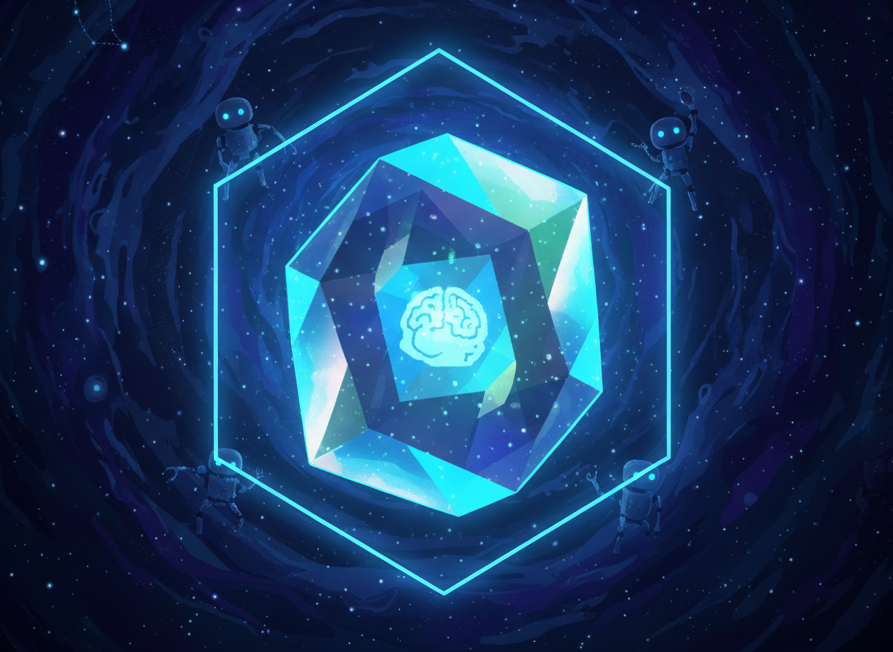
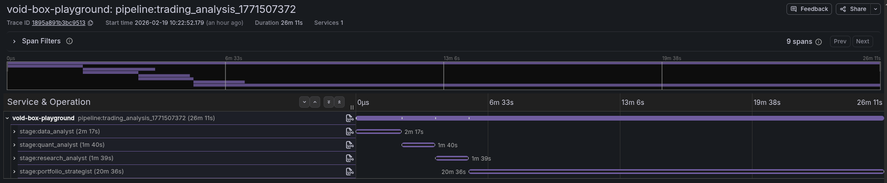

<div align="center">
  
  <h1>Void-Box</h1>
  <p><strong>Composable agent runtime with hardware isolation</strong></p>

  <p>
    <em>Design principle:</em> Skills are declared capabilities.<br>
    Capabilities only exist when bound to an isolated execution boundary.
  </p>

  <p><code>VoidBox = Agent(Skills) + Isolation</code></p>

  <!-- CI badge (official GitHub Actions badge) -->
  <a href="https://github.com/the-void-ia/void-box/actions/workflows/ci.yml">
    
  </a>

  <a href="https://github.com/the-void-ia/void-box/blob/main/LICENSE">
    
  </a>
  
</div>

<br>

<p align="center">
  <a href="docs/architecture.md">Architecture</a> ·
  <a href="#quick-start">Quick Start</a> ·
  <a href="#observability">Observability</a>
</p>

<p align="center">
  Local-first. Cloud-ready. Runs on any Linux host with <code>/dev/kvm</code>.
</p>

> **Status:** v0 (early release). Production-ready architecture; APIs are still stabilizing.

<p align="center">
  
</p>

---

## What You Get

- **Hardware isolation** — KVM micro-VMs, not containers. Fresh micro-VM per stage.
- **Policy-enforced execution** — Command allowlists, rlimits, seccomp-BPF, and controlled network egress.
- **Skill-native** — Procedural knowledge (SKILL.md), MCP servers, and CLI tools provisioned into the sandbox.
- **Composable pipelines** — Sequential `.pipe()`, parallel `.fan_out()`, streaming output with stage-level failure domains.
- **Model flexibility** — claude-code agent per stage, backed by Claude API (default) or local Ollama models.
- **Observability built-in** — OTLP traces/metrics, structured logs, and guest telemetry via procfs.
- **No root required** — Usermode SLIRP networking via smoltcp (no TAP devices).

Isolation is the primitive. Pipelines are compositions of bounded execution environments.

---

## Quick Start

### 1. Add dependency

```bash
cargo add void-box
```

### 2. Define skills and build a VoidBox

```rust
use void_box::agent_box::VoidBox;
use void_box::skill::Skill;
use void_box::llm::LlmProvider;

// Skills = declared capabilities
let hn_api = Skill::file("skills/hackernews-api.md")
    .description("HN API via curl + jq");

let reasoning = Skill::agent("claude-code")
    .description("Autonomous reasoning and code execution");

// VoidBox = Agent(Skills) + Isolation
let researcher = VoidBox::new("hn_researcher")
    .skill(hn_api)
    .skill(reasoning)
    .llm(LlmProvider::ollama("qwen3-coder")) // claude-code runtime using Ollama backend
    .memory_mb(1024)
    .network(true)
    .prompt("Analyze top HN stories for AI engineering trends")
    .build()?;
```

### 3. Run

```rust
let result = researcher.run(None).await?;
println!("{}", result.claude_result.result_text);
```

---
## Architecture

```
┌──────────────────────────────────────────────┐
│ Host                                         │
│  VoidBox Engine / Pipeline Orchestrator      │
│                                              │
│  ┌─────────────────────────────────────┐     │
│  │ VMM (KVM)                           │     │
│  │  vsock ←→ guest-agent (PID 1)       │     │
│  │  SLIRP ←→ eth0 (10.0.2.15)          │     │
│  └─────────────────────────────────────┘     │
│                                              │
│  Seccomp-BPF │ OTLP export                   │
└──────────────┼───────────────────────────────┘
     Hardware  │  Isolation
═══════════════╪════════════════════════════════
               │
┌──────────────▼──────────────────────────────────────┐
│ Guest VM (Linux)                                    │
│  guest-agent: auth, allowlist, rlimits              │
│  claude-code runtime (Claude API or Ollama backend) │
│  skills provisioned into isolated runtime           │
└─────────────────────────────────────────────────────┘
```

See [docs/architecture.md](docs/architecture.md) for the full component diagram, wire protocol, and security model.

## Observability

Every pipeline run is fully instrumented out of the box. Each VM stage emits
spans and metrics via OTLP, giving you end-to-end visibility across isolated
execution boundaries — from pipeline orchestration down to individual tool calls
inside each micro-VM.

<p align="center">
  
</p>

- **OTLP traces** — Per-box spans, tool call events, pipeline-level trace
- **Metrics** — Token counts, cost, duration per stage
- **Structured logs** — `[vm:NAME]` prefixed, trace-correlated
- **Guest telemetry** — procfs metrics (CPU, memory) exported to host via vsock

Enable with `--features opentelemetry` and set `VOIDBOX_OTLP_ENDPOINT`.
See the [playground](playground/) for a ready-to-run stack with Grafana, Tempo, and Prometheus.

## Next Up

- **Session persistence** — Run/session state with pluggable backends (disk, SQLite, Valkey).
- **Rich TUI** — Claude-like interactive experience: panel-based, live-streaming dashboard built on the event API.
- **virtio-blk** — Persistent block devices for stateful workloads across VM restarts.
- **aarch64** — ARM64 builds and CI (cross-compilation in a release pipeline).
- **Language bindings** — Python and Node.js SDKs for the daemon API.

## Running & Testing

### Mock mode (no KVM required)

```bash
cargo run --example quick_demo
cargo run --example trading_pipeline
cargo run --example parallel_pipeline
```

### KVM mode

```bash
# Build guest initramfs
scripts/build_guest_image.sh

# Run with Claude API
ANTHROPIC_API_KEY=sk-ant-xxx \
VOID_BOX_KERNEL=/boot/vmlinuz-$(uname -r) \
VOID_BOX_INITRAMFS=/tmp/void-box-rootfs.cpio.gz \
cargo run --example trading_pipeline

# Or with Ollama
OLLAMA_MODEL=qwen3-coder \
VOID_BOX_KERNEL=/boot/vmlinuz-$(uname -r) \
VOID_BOX_INITRAMFS=/tmp/void-box-rootfs.cpio.gz \
cargo run --example trading_pipeline
```

### Parallel pipeline with per-box models

```bash
OLLAMA_MODEL=phi4-mini \
OLLAMA_MODEL_QUANT=qwen3-coder \
OLLAMA_MODEL_SENTIMENT=phi4-mini \
VOID_BOX_KERNEL=/boot/vmlinuz-$(uname -r) \
VOID_BOX_INITRAMFS=/tmp/void-box-rootfs.cpio.gz \
cargo run --example parallel_pipeline
```

### Tests

```bash
cargo test --lib                      # Unit tests
cargo test --test skill_pipeline      # Integration tests (mock)
cargo test --test integration         # Integration tests

# E2E (requires KVM + test initramfs)
scripts/build_test_image.sh
VOID_BOX_KERNEL=/boot/vmlinuz-$(uname -r) \
VOID_BOX_INITRAMFS=/tmp/void-box-test-rootfs.cpio.gz \
cargo test --test e2e_skill_pipeline -- --ignored --test-threads=1
```

## License

Apache-2.0 · [The Void Platform](LICENSE)

