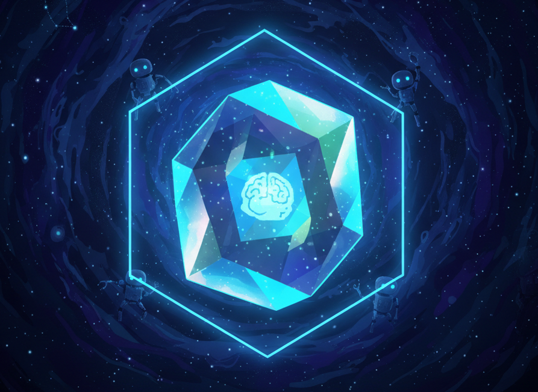

<div align="center">
  
  <h1>Void-Box</h1>
  <p><strong>Composable agent runtime with enforced isolation boundaries</strong></p>

  <p>
    <em><strong>Design principle:</strong></em> Skills are declared capabilities.<br>
    Capabilities only exist when bound to an isolated execution boundary.
  </p>

  <p><code>VoidBox = Agent(Skills) + Isolation</code></p>

  <!-- CI badge (official GitHub Actions badge) -->
  <a href="https://github.com/the-void-ia/void-box/actions/workflows/ci.yml">
    
  </a>

  <a href="https://github.com/the-void-ia/void-box/blob/main/LICENSE">
    
  </a>
  
</div>

<br>

<p align="center">
  <a href="https://the-void-ia.github.io/void-box/docs/architecture/">Architecture</a> ·
  <a href="#install-the-voidbox-cli">Install</a> ·
  <a href="#quick-start">Quick Start</a> (<a href="#using-the-cli">CLI</a> · <a href="#using-the-rust-library">Rust</a>) ·
  <a href="https://the-void-ia.github.io/void-box/docs/oci-containers/">OCI Support</a> ·
  <a href="https://the-void-ia.github.io/void-box/docs/host-mounts/">Host Mounts</a> ·
  <a href="https://the-void-ia.github.io/void-box/docs/snapshots/">Snapshots</a> ·
  <a href="https://the-void-ia.github.io/void-box/guides/observability-setup/">Observability</a>
</p>

<p align="center">
  Local-first. Cloud-ready. Runs on any Linux host with <code>/dev/kvm</code>.
</p>

> **Status:** v0 (early release). Production-ready architecture; APIs are still stabilizing.

<p align="center">
  
</p>

---

## What You Get

- **Isolated execution** — Each stage runs inside its own micro-VM boundary, not shared-process containers.
- **Policy-enforced runtime** — Command allowlists, resource limits, seccomp-BPF, and controlled network egress.
- **Skill-native model** — MCP servers, SKILL files, and CLI tools mounted as declared capabilities.
- **Composable pipelines** — Sequential `.pipe()`, parallel `.fan_out()`, with explicit stage-level failure domains.
- **Vendor-neutral agent runtime** — Bring your own agent: Claude Code, OpenAI Codex, Ollama, LM Studio, or any Anthropic-compatible endpoint. The `llm.provider` field selects the agent binary and auth — void-box handles the isolation, not the model choice.
- **OCI-native** — Auto-pulls guest images from GHCR; mount container images as base OS or skill providers.
- **Observability native** — OTLP traces, metrics, structured logs, and stage-level telemetry emitted by design.
- **Persistent host mounts** — Share host directories into guest VMs via 9p/virtiofs with read-only or read-write mode.
- **No root required** — Usermode SLIRP networking via smoltcp (no TAP devices).

> Isolation is the primitive. Pipelines are compositions of bounded execution environments.

## Why Not Containers?

Containers share a host kernel — sufficient for general isolation, but AI agents executing tools, code, and external integrations create shared failure domains. VoidBox binds each agent stage to its own micro-VM boundary, enforced by hardware virtualization rather than advisory process controls. See [Architecture](https://the-void-ia.github.io/void-box/docs/architecture/) ([source](docs/architecture.md)) for the full security model.

---

## Install the `voidbox` CLI

Each [release](https://github.com/the-void-ia/void-box/releases) ships **`voidbox`** together with a **kernel** and **initramfs** so you can run workloads out of the box.

### Shell installer (Linux & macOS)

```bash
curl -fsSL https://raw.githubusercontent.com/the-void-ia/void-box/main/scripts/install.sh | sh
```

Installs to `/usr/local/bin` and `/usr/local/lib/voidbox/`. For a specific version: `VERSION=v0.1.2 curl -fsSL ... | sh`.

### Homebrew (macOS)

```bash
brew tap the-void-ia/tap
brew install voidbox
```

### Debian / Ubuntu

Download the `.deb` for your CPU (`amd64` or `arm64`) from [Releases](https://github.com/the-void-ia/void-box/releases). Example for v0.1.2 on amd64:

```bash
curl -fsSLO https://github.com/the-void-ia/void-box/releases/download/v0.1.2/voidbox_0.1.2_amd64.deb
sudo dpkg -i voidbox_0.1.2_amd64.deb
```

### Fedora / RHEL

```bash
sudo rpm -i https://github.com/the-void-ia/void-box/releases/download/v0.1.2/voidbox-0.1.2-1.x86_64.rpm
```

Use the matching `.rpm` name from [Releases](https://github.com/the-void-ia/void-box/releases) for your version and architecture.

### Next steps

| | |
|---|---|
| **[Getting Started](https://the-void-ia.github.io/void-box/guides/getting-started/)** | First run, environment variables, API keys |
| **[Install (site)](https://the-void-ia.github.io/void-box/)** | Copy-paste install block and direct tarball links |

If you use Rust already, you can also `cargo install void-box` for the CLI only — pair it with kernel and initramfs from a [release tarball](https://github.com/the-void-ia/void-box/releases) or another install method above.

---

## Quick Start

### Using the CLI

With [`voidbox`](#install-the-voidbox-cli) on your `PATH`, run an agent from a YAML spec. From a clone of this repository:

```bash
voidbox run --file examples/hackernews/hackernews_agent.yaml
```

**CLI overview:** `voidbox run`, `validate`, `inspect`, `skills`, `snapshot`, and `config` run locally and do not require a background server. For HTTP remote control, start `voidbox serve` (default `127.0.0.1:43100`), then use `status`, `logs`, or `tui` against that daemon. Full command reference: [CLI + TUI](https://the-void-ia.github.io/void-box/docs/cli-tui/).

The full spec lives in [`examples/hackernews/hackernews_agent.yaml`](examples/hackernews/hackernews_agent.yaml). A minimal shape looks like:

```yaml
api_version: v1
kind: agent
name: hn_researcher
sandbox:
  mode: auto
  memory_mb: 1024
  network: true
llm:
  provider: claude        # or: codex, claude-personal, ollama, lm-studio, custom
agent:
  prompt: "Your task…"
  skills:
    - "file:examples/hackernews/skills/hackernews-api.md"
  timeout_secs: 600
```

Supported `llm.provider` values:

| Provider | Agent binary | Auth | Build script |
|---|---|---|---|
| `claude` | `claude-code` | `ANTHROPIC_API_KEY` | `scripts/build_claude_rootfs.sh` |
| `claude-personal` | `claude-code` | Host `~/.claude` OAuth credentials | `scripts/build_claude_rootfs.sh` |
| `codex` | `codex` | Host `~/.codex/auth.json` (ChatGPT login) or `OPENAI_API_KEY` | `scripts/build_codex_rootfs.sh` |
| `ollama` | `claude-code` | Ollama on host (via SLIRP gateway) | `scripts/build_claude_rootfs.sh` |
| `lm-studio` | `claude-code` | LM Studio on host (via SLIRP gateway) | `scripts/build_claude_rootfs.sh` |
| `custom` | `claude-code` | Custom `ANTHROPIC_BASE_URL` | `scripts/build_claude_rootfs.sh` |

### Using the Rust library

Add the crate and build a `VoidBox` in code:

```bash
cargo add void-box
```

```rust
use void_box::agent_box::VoidBox;
use void_box::skill::Skill;
use void_box::llm::LlmProvider;

// Skills = declared capabilities
let hn_api = Skill::file("skills/hackernews-api.md")
    .description("HN API via curl + jq");

let reasoning = Skill::agent("claude-code")
    .description("Autonomous reasoning and code execution");

// VoidBox = Agent(Skills) + Isolation
let researcher = VoidBox::new("hn_researcher")
    .skill(hn_api)
    .skill(reasoning)
    .llm(LlmProvider::ollama("qwen3-coder"))
    .memory_mb(1024)
    .network(true)
    .prompt("Analyze top HN stories for AI engineering trends")
    .build()?;
```

---

## Documentation

| | |
|---|---|
| **[Architecture](https://the-void-ia.github.io/void-box/docs/architecture/)** | Component diagram, data flow, security model |
| **[Runtime Model](https://the-void-ia.github.io/void-box/docs/runtime/)** | Claude Code runtime, LLM providers, skill types |
| **[CLI + TUI](https://the-void-ia.github.io/void-box/docs/cli-tui/)** | Command reference, daemon API endpoints |
| **[Events + Observability](https://the-void-ia.github.io/void-box/docs/events-observability/)** | Event types, OTLP traces, metrics |
| **[OCI Containers](https://the-void-ia.github.io/void-box/docs/oci-containers/)** | Guest images, base images, OCI skills |
| **[Snapshots](https://the-void-ia.github.io/void-box/docs/snapshots/)** | Sub-second VM restore, snapshot types |
| **[Host Mounts](https://the-void-ia.github.io/void-box/docs/host-mounts/)** | 9p/virtiofs host directory sharing |
| **[Security](https://the-void-ia.github.io/void-box/docs/security/)** | Defense in depth, session auth, seccomp |
| **[Wire Protocol](https://the-void-ia.github.io/void-box/docs/wire-protocol/)** | vsock framing, message types |

### Guides

| | |
|---|---|
| **[Getting Started](https://the-void-ia.github.io/void-box/guides/getting-started/)** | Install, first agent, first run |
| **[Running on Linux](https://the-void-ia.github.io/void-box/guides/running-on-linux/)** | KVM setup, manual build, mock mode, tests |
| **[Running on macOS](https://the-void-ia.github.io/void-box/guides/running-on-macos/)** | Apple Silicon, Virtualization.framework |
| **[Observability Setup](https://the-void-ia.github.io/void-box/guides/observability-setup/)** | OTLP config, Grafana playground |
| **[AI Agent Sandboxing](https://the-void-ia.github.io/void-box/guides/ai-agent-sandboxing/)** | Isolated micro-VM agent execution |
| **[Pipeline Composition](https://the-void-ia.github.io/void-box/guides/pipeline-composition/)** | Multi-stage pipelines with .pipe() and .fan_out() |
| **[YAML Specs](https://the-void-ia.github.io/void-box/guides/yaml-specs/)** | Declarative agent/pipeline definitions |
| **[Local LLMs](https://the-void-ia.github.io/void-box/guides/ollama-local/)** | Ollama integration via SLIRP networking |

---

## Roadmap

VoidBox is evolving toward a durable, capability-bound execution platform.

- **Session persistence** — Durable run/session state with pluggable backends (filesystem, SQLite, Valkey).
- **Terminal-native interactive experience** — Panel-based, live-streaming interface powered by the event API.
- **Language bindings** — Python and Node.js SDKs for daemon-level integration.

## License

Apache-2.0 · [The Void Platform](LICENSE)
