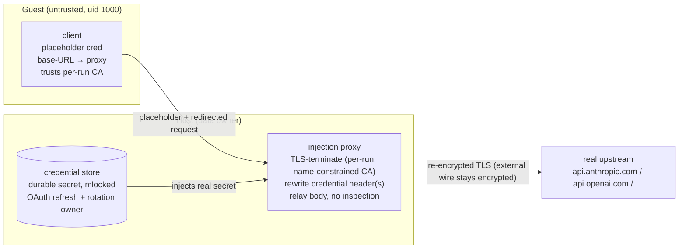
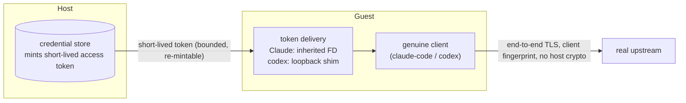

# Design: host-mediated credential containment for the guest agent

Status: proposal.

**What this is.** A design for keeping durable credentials — API keys and OAuth
refresh tokens — off the guest agent and injecting them only at the network egress
that needs them. The mechanism is a host-side **injection proxy** (it rewrites the
credential header at egress) backed by a host **credential store** (it holds the
durable secret and performs OAuth refresh). A fallback, **token injection** (handing
the guest a short-lived token instead of proxying), is a gated, drop-by-default
option.

The store and proxy are the **single committed mechanism** for all credential
delivery. Token injection is retained only as a detection-safety fallback for personal
OAuth subscriptions (a user's own Claude Pro/Max or ChatGPT plan, as opposed to an API
key), to be dropped if validation (V2 + the ToS/detection check) shows that proxying a
personal subscription does not risk the account.

Provider behaviors here are confirmed against Claude Code 2.1.170 and openai/codex
0.140.0 (pre-release `rust-v0.140.0-alpha.2`). The bundled versions
(`scripts/agents/manifest.toml`) currently differ — claude-code 2.1.143, codex
0.137.0 — so re-verify these behaviors against the bundled binaries before relying on
them, and on every version bump (R9).

**Scope.** This design covers *credential containment* — keeping durable credentials
off the guest and injecting them at egress for the endpoints that need them. It uses
**selective routing**: the LLM-provider clients always go through the proxy, and any
additional downstream service that needs a host-held credential can be routed through
it too (GitHub, Slack, etc. — examples, not commitments). Network **egress policy** — which
destinations the agent may reach at all, audit, allow-lists, and routing profiles —
is **orthogonal and specified separately** (`docs/design/egress-policy.md`).
Credential containment holds under any egress policy.

## Trust model

**Single-tenant *for this feature*.** Credential containment assumes the host operator
is the data owner, authorized to see all guest plaintext — the operator already owns
the guest's RAM, filesystem, and network, and the injection proxy terminates TLS on
the host. (void-box's VM isolation can host mutually-distrusting sandboxes; that is
orthogonal — this feature assumes operator-as-data-owner, not that void-box is
single-tenant overall.) The guest agent (uid 1000) is untrusted, the expected
adversary (prompt injection, a compromised dependency). The design is **not** suitable
as-is where the operator
must not read tenant data — proxy TLS termination would expose it; that deployment
needs an additional control and is out of scope. This boundary also tracks provider
policy (below): a user running their own subscription is "ordinary use"; an operator
routing other users' subscription credentials is not.

## North star and invariant

void-box lets an agent **use** credentials without **holding** the durable ones.

- **Invariant:** durable credentials — OAuth **refresh** tokens, long-lived **API
  keys**, and downstream service secrets — never enter the guest. The host holds
  them, performs all refresh, and is the sole rotation owner. Any token the guest
  holds is short-lived and host-revocable.
- **Stronger tier (proxy):** the guest holds no credential at all, only non-secret
  placeholders. API keys, downstream injection, and OAuth all use this tier by
  default; the token-injection fallback (personal subscriptions only, pending
  validation) instead leaves a bounded short-lived token.

## The risk this addresses

The broker addresses a family of credential-exfiltration risks, not one. Their common
shape: a durable secret is staged into a guest the design treats as untrusted, where a
uid-1000 agent (via prompt injection or a compromised dependency) can read and
exfiltrate it for access that outlives the run. The secrets at risk span (1) **LLM-
provider credentials** — OAuth refresh tokens for `claude-personal`/`codex`, and API
keys for `Claude`/`codex`/`Custom` — and (2) **other downstream secrets** the workflow
or its skills consume — a GitHub token, a Slack token, registry credentials — whichever
the end user configures. Which risks are live depends on that configuration. The
provider credentials (always present) are detailed below; downstream secrets are
covered where their injection is described ("Downstream credential injection").

The `claude-personal` and `codex` providers stage the OAuth credential —
**including the refresh token** — into the guest: an RW bind-mount of the credential
file at `/home/sandbox/.claude` or `/home/sandbox/.codex`
(`src/runtime.rs:234-247`, `1399-1408`), or a privileged WriteFile copy
(`src/agent_box.rs:464`). A uid-1000 agent can read it and exfiltrate the refresh
token, yielding account access that outlives the run. Both CLIs self-refresh
in-process and rotate single-use refresh tokens, so host-only ownership is the only
correct design — two refreshers invalidate each other's token.

API-key auth carries the same exposure, worse: the default `Claude` provider
forwards `ANTHROPIC_API_KEY`, `codex` falls back to `OPENAI_API_KEY`, and `Custom`
providers forward their key — all into the guest exec env (`src/llm.rs:427,474,480`),
readable by uid 1000 and snapshot-captured. An API key is long-lived, non-rotating,
full billing access. In scope. (Local providers — Ollama, LM Studio — pass only
non-secret placeholders.)

A leaked short-lived access token (auto-expiring, host-re-mintable) is an accepted,
bounded residual, not the target.

## Provider terms of service

The mechanism choice is constrained by provider policy, not only by security.

- **API keys are the sanctioned path for programmatic use.** Anthropic's policy
  states OAuth "is intended exclusively for … ordinary use of Claude Code and other
  native Anthropic applications," that developers "building products or services …
  should use API key authentication," and that Anthropic "does not permit
  third-party developers … to route requests through Free, Pro, or Max plan
  credentials on behalf of their users"
  ([Claude Code legal & compliance](https://code.claude.com/docs/en/legal-and-compliance);
  [Anthropic Consumer Terms](https://www.anthropic.com/legal/consumer-terms);
  [Usage Policy](https://www.anthropic.com/legal/aup)). OpenAI similarly restricts
  programmatic ChatGPT-subscription use, tolerating personal use of the official
  codex CLI on one's own subscription
  ([OpenAI Terms](https://openai.com/policies/row-terms-of-use/);
  [Usage Policies](https://openai.com/policies/usage-policies/)). So the **API-key
  proxy path carries no policy tension** — programmatic/proxied use is the intended
  use of an API key.
- **Personal-subscription OAuth is "ordinary use" only when single-tenant.** A user
  running their own subscription through the real Claude Code/codex is ordinary use;
  an operator routing other users' subscription credentials is the prohibited
  pattern — the same boundary as the trust model. void-box must not be deployed as a
  multi-tenant service over subscription credentials; such deployments use API keys.
- **Containment-vs-policy tradeoff for personal OAuth.** Host-side refresh/injection
  means the OAuth token is used by the host store, not strictly by Claude Code — the
  gray edge of "ordinary use of Claude Code." Today's mount keeps the token's use
  inside the client (policy-cleaner) but leaks the refresh token (the risk above).
  For personal subscriptions this is a tradeoff the user owns; the policy-clean path
  for anything programmatic is API keys.

This is a reading of public policy, not legal advice; operators should consult the
linked terms for their use case.

## Mechanism: the host injection proxy

A host-side, TLS-terminating, header-injecting proxy, backed by the credential
store. Only the clients that need a host-held credential are pointed at it (selective
routing — see Scope); the client trusts a per-run CA installed in the guest
(name-constrained to the injected upstreams, so it can't impersonate arbitrary sites),
the proxy rewrites the credential header(s) with the host-held secret, and forwards to
the real upstream. The guest holds only placeholders (non-secret dummy values the
proxy replaces).

One shared proxy/store process is multiplexed across sandboxes; the per-run token and
name-constrained CA isolate runs.

**Credential store.** Holds each provider's durable secret — read from
`~/.claude`/`~/.codex`/Keychain, or the host env for API keys. For OAuth it refreshes
against the provider's token endpoint, mints short-lived access tokens **lazily on
first use, overlapped with VM boot** (never a serial pre-boot RTT), is the sole
rotation owner (serialized refresh, rate-capped), and **persists the rotated refresh
token back to the host** so subsequent runs stay valid. Write-back must be atomic
(temp + `rename`), `0600`, and locked across any processes/runs sharing the durable
credential file — a corrupt or raced write loses the single-use refresh token and can
lock the account out (R12). Secrets live only here, in host memory, `mlock`ed,
zeroized via `secrecy`, and shielded from core dumps (`PR_SET_DUMPABLE=0`).

**Shared, not per-sandbox.** One low-privilege host proxy/store process is multiplexed
across all sandboxes; the per-run token and name-constrained CA isolate runs from each
other. The isolation boundary is daemon-vs-proxy, not proxy-vs-proxy — so its memory
cost is fixed, not linear in VM count.

**Why TLS termination, and why it is safe.** The credential header lives inside the
TLS stream; rewriting it requires terminating TLS. Under the trust model this exposes
nothing new — the host already sees the guest's data. The proxy streams bodies
through without inspecting them, re-establishes TLS to the upstream (the external
wire stays encrypted), and trusts only a per-run CA installed in the guest image (a
scoped trust, not general interception). The one non-transparent effect: the upstream
sees the proxy's TLS fingerprint, not the client's (R7).

**API keys (`Claude`, `codex` env-key, `Custom`).** A static secret: the proxy
injects `x-api-key` (Anthropic) or `Authorization: Bearer` (OpenAI/codex; the Custom
provider's configured header). No refresh, no rotation, no policy tension — the
simplest slice and the first proof of the proxy spine (M0). codex API-key mode
targets `api.openai.com/v1`, redirected the same way.

**OAuth via the proxy (Claude/codex ChatGPT).**
- Claude: `ANTHROPIC_BASE_URL=<proxy>`, `NODE_EXTRA_CA_CERTS=<CA PEM>`,
  `CLAUDE_CODE_PROVIDER_MANAGED_BY_HOST=1` (suppresses the hardcoded OAuth-refresh
  recovery and force-login), placeholder `ANTHROPIC_AUTH_TOKEN`, no credentials
  file. Only `/v1/messages` blocks and it honors the base URL.
- codex: `openai_base_url=<proxy>` + `credentials_store="file"` in
  `$CODEX_HOME/config.toml`, `CODEX_CA_CERTIFICATE=<CA PEM>`, and a placeholder
  `auth.json` (dummy `id_token`, placeholder `access_token`/`account_id`, recent
  `last_refresh`). The proxy injects the real Bearer and `ChatGPT-Account-ID` (real
  identity stays host-side) and passes `originator` through. codex defaults to
  Responses-over-WebSocket — force plain HTTPS (`supports_websockets=false`) or
  inject on the WS upgrade (R8).

Neither client pins certificates; both honor an additive CA via the env above (PEM
file; not `SSL_CERT_DIR`).

## OAuth-provider delivery: proxy by default, token injection as a fallback

The proxy is the **default and preferred** mechanism for OAuth providers too — it
unifies delivery and leaves zero credential in the guest. But for OAuth it carries two
feasibility risks the API-key path does not: (1) **provider acceptance of host-side
refresh** — the token endpoint may reject a refresh grant replayed by the host store
rather than the genuine client (token binding/DPoP/attestation; R4); and (2)
**fingerprint / ToS flagging of personal accounts** — because the proxy terminates TLS,
the provider sees the proxy's fingerprint and a host-originated call under a
`claude-code`/`codex` user-agent, which anti-abuse heuristics on a *personal*
subscription may flag or ban (R7, R6). Both are retired by validation (V2 + the
ToS/detection check); until then token injection is the fallback.

**Token injection** is retained for one case: **personal subscriptions**. The proxy
terminates TLS, so the provider sees the *proxy's* fingerprint under a
`claude-code`/`codex` user-agent, and the *host* — not the genuine client — makes the
call. For a personal account under anti-abuse heuristics, that risks the provider
**flagging or banning the user's own account** — worse than the in-guest token it
avoids. Token injection keeps the genuine client making end-to-end-TLS calls (its own
fingerprint, no host crypto), at the cost of a bounded short-lived token in the guest
(R13), no clean Claude long-run refresh, and the codex loopback shim. Mechanics:
Claude via `CLAUDE_CODE_OAUTH_TOKEN_FILE_DESCRIPTOR` (inherited fd; ~24 h tokens cover
task-mode, long/service runs need re-mint-and-relaunch); codex via a loopback endpoint
behind `CODEX_REFRESH_TOKEN_URL_OVERRIDE`. It never applies to API keys — a static key
cannot be minted short-lived.

Trade-off vs. the proxy: preserves the genuine client's fingerprint and end-to-end TLS,
at the cost of a bounded short-lived token at rest in the guest (R13).

**Decision — gated, biased to drop it.** Ship the proxy for all providers. **Drop
token injection entirely if V2 + the ToS/detection check (above) show that proxying a
personal subscription is detection-safe and policy-tolerable**; keep it only if
personal accounts get flagged.

## Downstream credential injection

Some named downstream services need a host-held secret injected (e.g. a GitHub token
for `api.github.com`). The same proxy injects it: the service is routed to the proxy
by **explicit client config** (a `git` credential helper, or a scoped `HTTPS_PROXY`
for that host), and the proxy rewrites the auth header with the host-held credential.
These are usually static secrets (no OAuth refresh). The proxy injects a credential
only on **exact upstream host+path match**, never on agent-controlled redirects or
`Host` headers, and follows no credentialed redirects (R3). Per-destination injection
policy is operator-declared.

## Security properties

- **Refresh token / durable secret never in the guest** (both delivery paths) — held
  and rotated only on the host.
- **No credential at all in the guest** (proxy path; API keys and downstream
  always).
- **Single rotation owner** — only the host refreshes, removing the rotation-conflict
  failure mode.
- **Containment is bypass-safe** — a guest ignoring the proxy/injector cannot obtain
  a credential (a direct call to the upstream carries no valid token).
- **External wire stays encrypted** — for the proxy, TLS is re-established to the
  upstream; only a host-internal hop is plaintext.
- Opt-in; no behavior change for providers that do not stage a credential.

### Residual risks

- The durable secret now lives in **host** process memory for the run (vs. today's
  0600 temp file dropped on teardown) — a wider host-side surface on a shared host;
  mitigated by `mlock`/zeroize and per-run process isolation.
- Token-injection path: a short-lived access token (+ codex `id_token`/
  `account_id`) at rest in the guest for its lifetime, and captured in any snapshot
  taken during it.
- Proxy path: the host decrypts inference traffic (trust-model dependent); a
  hot-path availability coupling; the per-run proxy token is guest-readable (use, not
  theft — guards against neighbors, not the in-guest adversary).

## Snapshot / restore

Restore brings the guest back from a full memory image, so it returns holding whatever
it had at capture — that part is by design. The concern is **per-run auth material**:
the restore path reuses the snapshot's stored vsock session secret verbatim rather than
minting a fresh one (`src/vmm/mod.rs:646-665` — only the socket-path `runtime_id` is
regenerated; that reuse is a separate, tracked discrepancy, not behavior this design
relies on). The same path would carry a snapshot-delivered proxy token or CA into every
restored instance, defeating "per-run ephemeral" for them (R11). Two parts to the
solution:

- **Reconnecting a restored VM to the proxy.** The resumed guest keeps the original
  token and CA in restored RAM and does not re-read the kernel cmdline, so a host-side
  swap is invisible to it. Re-minting therefore happens **in-band over the control
  channel**: on restore the host generates a fresh per-run CA and proxy token and pushes
  them into the running guest (the CA via the additive env/PEM path the clients honor,
  the token into the proxy-auth slot) before the first credentialed egress; the proxy
  then accepts the new token and stops honoring the snapshot's old one. If a restore
  cannot re-install (control channel unavailable), credentialed egress fails closed
  rather than reusing stale material.
- **Keeping CA material out of the snapshot.** The CA **private key** and the credential
  store live only in the host proxy process — never in guest RAM, the cmdline, or
  `src/vmm/snapshot.rs` state — so they are structurally absent from any snapshot. Only
  the CA **public cert** is ever in the guest, and it is replaced on restore. The
  snapshot is still confidential regardless (it contains whatever short-lived token the
  guest held at capture time, bounded by that token's lifetime — R13).

## Performance

void-box gates cold boot at p50 ≤ 252 ms (≤ 400 ms threshold) and values VM density;
this design must not regress either. Required cheap defaults:

- **No host crypto on the inference stream.** Proxy injection terminates TLS and so
  pays per-byte crypto on both legs of the busiest flow in the system; token injection
  keeps inference end-to-end at zero host crypto. This is a consideration in the
  proxy-vs-injection trade-off for high-volume inference, not a standing recommendation
  (the ToS/detection analysis dominates the choice). When the proxy is used it
  re-originates without parsing the body (no content/DLP inspection by default).
- **Shared proxy (see Mechanism).** Because the proxy is shared rather than per-sandbox,
  its memory cost is fixed, not linear in VM count; a per-sandbox process with its own
  `mlock`ed store would fight density (KSM/balloon) as instances grow.
- **Cheap startup.** ECDSA P-256 per-run CA — keygen is on the cold-start budget;
  installed via the additive env-var/single-PEM path (no `ca-certificates`/initramfs
  rebuild); OAuth refresh lazy on first use, overlapped with boot, never a serial
  pre-boot RTT. Add this feature to the startup-bench gate.

## Risk register

Severity is in-column; mitigations are required, not optional.

| # | Risk | Likelihood | Impact | Mitigation / fallback |
|---|------|-----------|--------|-----------------------|
| R1 | **Proxy streaming/lifecycle correctness** — TLS-terminate + SSE + WS + backpressure + reuse + fail-closed, on every routed call; a bug degrades all output. | Medium | High | Standard reverse-proxy patterns + dedicated streaming tests; primary engineering budget. Proxy path only. |
| R2 | **CA private-key custody / blast radius** (proxy) — a leaked CA key impersonates sites to the guest. | Low | High | **Per-run ephemeral CA**, **Name-Constrained** to the injected upstreams, generated at boot and destroyed on teardown; the private key never reaches the guest, the cmdline, or a snapshot (R11). Confirm each client **enforces** name constraints (V1) — a client that ignores them turns the CA into a universal MITM anchor. |
| R3 | **SSRF / confused-deputy** via the credential-injecting proxy. | Medium | Medium–High | Exact host+path injection match; no credentialed redirects; no agent-controlled `Host`; resolve **once** and pin that exact IP for the connection (no connect-time re-resolve); reject RFC-1918/link-local, IPv6 ULA/`::1`, CGNAT `100.64/10`, and the SLIRP gateway→host-loopback mapping. |
| R4 | **Host-side OAuth refresh acceptance** — the token endpoint accepting an off-client refresh (refresh grant has no PKCE, but tokens could be binding-bound). | Low–Med | Medium–High | Confirm in V2 (throwaway). Evidence: standard refresh shape, plain Bearer, no DPoP observed; same egress IP via NAT. |
| R5 | **Inference acceptance of a host-supplied subscription Bearer.** | Low–Med | Medium–High | V2. Precedent: `CLAUDE_CODE_OAUTH_TOKEN` is an externally-supplied subscription Bearer the inference endpoint accepts. |
| R6 | **Provider ToS** — personal-subscription OAuth used outside the native client, or multi-tenant routing of subscription credentials, is restricted. | — | High (policy) | API keys for programmatic/hosted use; personal-OAuth is single-tenant ordinary use, user-owned (see ToS section). |
| R7 | **TLS fingerprint** — proxy termination changes the upstream-visible JA3/JA4; on subscription endpoints a client mismatch could be a signal. | Low | Low–Med | Low signal on API endpoints (diverse clients expected); token injection preserves the client fingerprint; uTLS-style impersonation if needed. |
| R8 | **codex WebSocket transport** vs header injection. | Low | Low–Med | Default `supports_websockets=false` (plain HTTPS); inject-on-upgrade optional. |
| R9 | **Provider version drift** changing redirect/refresh/header/transport behavior. | Low | Low–Med | Pin versions; re-verify V1/V2 facts on bump (bump workflow gates it). |
| R10 | **Guest→host parser surface** — the proxy parses attacker-controlled HTTP/CONNECT/WS/TLS-ClientHello on the host, in the hot path before any auth gate; qualitatively wider than today's narrow authenticated vsock protocol. | Medium | High | Memory-safe parser (`hyper`/`rustls`), strict size/lifetime limits, and run the proxy in a **separate low-privilege process** — one shared process across sandboxes (the isolation boundary is daemon-vs-proxy; per-run token + CA isolate runs), so a parser compromise is not a host-runtime compromise. |
| R11 | **Snapshot/restore reuse of per-run material** — a snapshot persists guest RAM + auth state and restore reuses it verbatim (verified: `src/vmm/mod.rs:646-665` reuses the stored session secret on restore), so a proxy token or CA the guest holds is carried into every restored instance, defeating "per-run ephemeral." | Low–Med | Medium–High | The resumed guest keeps the original token/CA in restored RAM and does not re-read the cmdline, so re-minting requires **re-installing the new material into the running guest over the control channel**, not a host-side swap; otherwise restored instances reuse it (bounded by treating the snapshot as confidential). Keep the CA **private key** and the store in the host proxy process — outside the snapshot — regardless; only the public cert is ever in the guest. |
| R12 | **Rotated-token write-back safety** — a non-atomic or raced write to the on-disk durable credential corrupts a single-use refresh token → account lockout. | Low–Med | Medium–High | Atomic temp + `rename`, `0600`, cross-process/run lock on the credential file. |
| R13 | **Intra-guest token harvesting** (token-injection path) — the codex loopback shim / FD injector is reachable by sibling uid-1000 processes. | Medium | Medium | The loopback shim requires a per-consumer secret; prefer the proxy path (zero in-guest credential). |
| R14 | **Half-migration** — a provider routed to the proxy while `src/llm.rs` still forwards its real env key leaves both the placeholder routing and the real credential in the guest. | Low | High | An **automated "no real credential in the guest" assertion** (env, files, mounts) gates each provider migration — not manual review. |

## Validation order and implementation plan

Two technical gates retire the feasibility unknowns before milestone work; provider
policy is settled by reading the terms (ToS section), not by a spike.

**V1 — redirect / CA / suppression on the pinned versions (no account, gates all
proxy provisioning).**

1. Stand up a throwaway HTTPS proxy with a self-signed CA that logs requests and
   forwards upstream.
2. Claude: set `ANTHROPIC_BASE_URL=<proxy>`, `NODE_EXTRA_CA_CERTS=<CA PEM>`,
   `CLAUDE_CODE_PROVIDER_MANAGED_BY_HOST=1`, a placeholder `ANTHROPIC_AUTH_TOKEN`,
   and no credentials file; run `claude -p "hi"`.
3. codex: set `openai_base_url=<proxy>` + `credentials_store="file"` in
   `config.toml`, `CODEX_CA_CERTIFICATE=<CA PEM>`, and a placeholder `auth.json`;
   run `codex exec "hi"` (set `supports_websockets=false` to force plain HTTPS).
4. **Pass:** both clients route inference through the proxy, trust the CA, do not
   hard-fail on the missing real credential, and trigger no force-login or
   retry-storm against hardcoded endpoints. Confirm codex emits `ChatGPT-Account-ID`
   + `originator`, and that each client **enforces** the CA's name constraints (a cert
   under the per-run CA for an out-of-constraint host is rejected — R2/R11). Unblocks
   M0 and the proxy path.

**V2 — OAuth acceptance (throwaway account, OAuth path only; the API-key path skips
this).**

1. On a throwaway Claude Pro/Max and a throwaway ChatGPT Plus account, log in
   normally and capture the real refresh token.
2. Host-side, replay the refresh (`client_id` + `grant_type=refresh_token` +
   `refresh_token`) against each token endpoint; confirm a usable access token comes
   back, and **store the rotated refresh token host-side** (R4).
3. Inject the minted Bearer through the proxy on one real inference request per
   provider; confirm a usable completion (R5).
4. **Pass:** host-minted tokens authenticate inference for both providers. Watch for
   any extra required header/param or a `401/403` indicating token binding/
   attestation. **Fail → the credential-store premise needs a rethink** (fall back
   to API-key-only, or re-evaluate token injection).

**Then build, smallest-risk first:**
- **M0** — static-key proxy for the **API-key** providers (Anthropic `x-api-key`,
  OpenAI/codex Bearer, Custom). No credential store, refresh, or rotation. Ungated by
  V2 and by the OAuth decision; needs only V1 plus the per-run name-constrained CA
  (R2) and the streaming proxy (R1). The lowest-risk proof of the proxy spine, so it
  leads.
- **M1a** — credential store (refresh/mint/rotation + host write-back) + the **proxy**
  OAuth path for **Claude only** (the token-injection fallback only if retained),
  single platform, inference path. Reuses M0's CA and streaming proxy.
- **M1b** — codex (WS handling, R8), long-run rotation, and KVM+VZ parity.
- **M2** — downstream credential injection for named services (e.g. GitHub), explicit
  routing, per-destination policy, SSRF hardening (R3).

Remove the RW credential mounts and the `src/agent_box.rs:464` WriteFile copy as each
provider migrates. Exit gate: `e2e_agent_mcp` (Claude) and the codex smoke specs pass,
plus an **automated assertion that the guest holds no real credential** — env, files,
and mounts — gating each provider migration so a half-migrated provider cannot leave
both the proxy routing and the real key in the guest (R14).

## Implementation readiness

What an implementer can take as settled versus what they must still design.

**Settled — do not re-derive:** the invariant, trust model, and ToS boundary; the
mechanism (host injection proxy + credential store; selective routing of credentialed
endpoints); the per-provider client knobs (env vars, config, headers) and their
verified behavior; the milestone order (M0 leads); the risk register and the V1/V2
gates.

**The implementer must design (within the chosen approach):**
- **Guest→proxy reachability and binding** — how a configured client reaches the
  proxy (host listener via the SLIRP gateway), bound guest-only per platform
  (loopback on KVM; a VZ-specific address on macOS, not `UNSPECIFIED`).
- **Per-run proxy token** — generation, injection into the guest, the proxy-side
  check, and stripping it before forwarding upstream.
- **Per-run CA** — **ECDSA P-256** (keygen is on the cold-start budget),
  name-constrained, installed via the additive env-var/single-PEM path
  (`NODE_EXTRA_CA_CERTS`, `CODEX_CA_CERTIFICATE`) — never a `ca-certificates` bundle or
  initramfs rebuild; teardown on exit; the private key stays in the host proxy process
  only.
- **Lifecycle placement** — a **shared, multiplexed** low-privilege proxy/store process
  (per-run token + name-constrained CA isolate runs), started once and kept warm;
  per-sandbox only if a tenant-isolation requirement forces it (a process per sandbox
  fights VM density).
- **Snapshot/restore re-mint** — regenerate the per-run CA and re-mint the proxy token
  on restore; keep both out of any guest-visible or snapshot-persisted channel (R11).
- **Proxy process isolation** — run the TLS-terminating/header-injecting parser in a
  separate low-privilege host process (R10).
- **Credential store internals** — reuse the discovery in `src/credentials.rs`;
  per-provider refresh-request construction; token cache + serialized refresh; host
  write-back of rotated tokens.

**Decisions to escalate (do not guess):**
- Whether to **drop token injection** (proxy-only). The design defaults to proxy-only;
  keep token injection only if V2 + the ToS/detection check show proxying a personal
  subscription flags the account.
- Whether to contain personal-subscription OAuth at all given the ToS tradeoff, or to
  steer programmatic use to API keys.

**Suggested first session:** run V1, then build M0 (which needs the proxy
reachability, per-run token, CA install, and lifecycle placement — all reusable by
M1). Defer the credential store until V2 passes; bring the drop-token-injection
decision to a human.

## Affected code

- New host modules — the credential store (durable secret custody; OAuth
  refresh/mint/rotation + host write-back) and the injection proxy (TLS-terminating,
  header-rewriting, streaming) plus the per-run CA.
- `src/credentials.rs` — host-retained credential, host-side refresh/rotation,
  short-lived-token minting; staging is host-only.
- `src/runtime.rs` (`~234-247`, `~1399-1408`), `src/agent_box.rs` (`~464`) — remove the
  RW mount and the WriteFile copy; provision the guest per the chosen mechanism.
- `src/llm.rs` — provider → store/proxy/injector wiring, replacing the API-key env
  forwarding in `env_vars()` (`~417`).
- `src/network/*` — the credential proxy is reached by the configured clients via the
  SLIRP gateway; it does **not** change egress policy (owned by the egress design).
- `src/vmm/snapshot.rs` / `src/vmm/mod.rs` — exclude the CA private key and store from
  the snapshot, and re-mint the per-run CA + proxy token on restore (R11).
- Guest image — install the per-run CA into the trust stores the clients honor
  (`NODE_EXTRA_CA_CERTS`; `CODEX_CA_CERTIFICATE`/`SSL_CERT_FILE`) — a per-image
  checklist across initramfs and OCI-rootfs.
- `scripts/agents/manifest.toml` — the bundled provider versions; re-verify these
  behaviors against them on bumps (R9).
