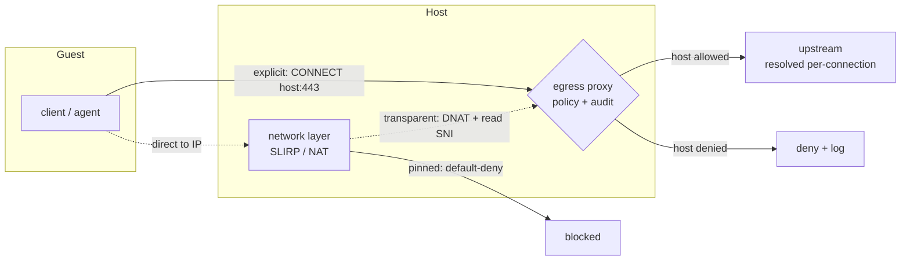

# Design (DRAFT): guest egress policy and profiles

Status: **draft / skeleton** — to be developed into a full design. This document
captures the use cases, today's mechanism, and the high-level shape of a configurable
egress policy; the low-level component design is an outline with open questions to
resolve.

Egress policy is **orthogonal to credential containment**
(`docs/design/credential-broker.md`). Credential containment keeps durable secrets
off the guest and injects them for specific endpoints via selective routing; it holds
under any egress policy. This document governs **which destinations the agent may
reach at all, how that traffic is audited, and how it is routed** — independent of
whether a credential is injected.

## 1. Use cases

The egress need varies widely per workflow; the policy must span the range, not pick
one point.

- **Open research / browse.** "Investigate something on the web and write a report."
  The agent fetches arbitrary, *unknown-in-advance* domains (search results, articles,
  docs). Cannot be allow-listed ahead of time → needs an open (or open-but-monitored)
  reach.
- **Bounded to a known set of public services.** A workflow that uses, say, PyPI +
  npm + a few documentation sites. Allow-listable by domain.
- **LLM provider only.** Pure codegen/reasoning with no external data. Tightest reach.
- **LLM provider + one or two services.** e.g. provider + `api.github.com` for a PR
  workflow. Allow-list of a small set.
- **Internal/enterprise.** Reach only specific internal hosts (behind the operator's
  network), nothing else.
- **Air-gapped-ish / no network.** Local providers (Ollama/LM Studio) only; deny all
  external egress.

Cross-cutting needs:
- **Audit / observability** — a record of what the agent contacted (destinations,
  volume, timing), regardless of profile, for review and incident response.
- **Rate-limiting / kill-switch** — bound or cut egress without killing the run.
- **Data-exfiltration containment** — for tasks handling sensitive input, bound where
  the agent can send data.

## 2. What void-box has today

- **SLIRP userspace network** (`src/network/slirp.rs`): guest `10.0.2.15`, gateway
  `10.0.2.2` (→ host loopback), DNS `10.0.2.3`. TCP, UDP, and ICMP-echo are relayed;
  ARP is answered locally by the gateway; other protocols are dropped.
- **Stateless NAT with a deny-list** (`src/network/nat.rs`): `translate_outbound`
  checks `Rules.deny_cidrs` first (return `None` = blocked), then forwards everything
  else (gateway IP → loopback; other IPs pass through). `Rules::default()` has an
  **empty deny-list → default-allow** (`empty_deny_list_allows_all`); the deployed
  `SlirpBackend::new()` seeds a `169.254.0.0/16` deny, so link-local/metadata is
  already blocked. There is **no allow-list** and no per-name (domain) capability —
  translation is purely IP/CIDR-based.
- **Connection limits** exist in the SLIRP layer (`max_concurrent_connections`,
  `max_connections_per_second`) — a coarse rate control.
- **No egress audit/log** of destinations, no domain awareness, no host-side egress
  proxy for general traffic (the credential proxy, when built, handles only the
  credentialed endpoints it is pointed at).

**Gap:** today's model can only *block named CIDRs*; it cannot *restrict to* a set,
cannot express *domains*, and cannot audit. It is the wrong shape for any of the
bounded use cases.

## 3. Egress profiles and configuration

### Prior art and conventions to adopt

Egress firewalling is well-trodden; this design follows established conventions rather
than a bespoke DSL.

- **Stripe Smokescreen** — an HTTP CONNECT egress proxy purpose-built as a firewall for
  untrusted workloads (the closest precedent). Default-deny **allow-list of
  hostnames**, **`report` vs `enforce`** modes, and resolve-each-domain-then-**block
  internal/RFC-1918 IPs** (SSRF protection), with role-based ACLs in YAML. A strong
  reference design (Go); port the pattern to Rust or reuse it (Open question 9).
  [README](https://github.com/stripe/smokescreen/blob/master/README.md),
  [sample ACL](https://github.com/stripe/smokescreen/blob/master/pkg/smokescreen/acl/v1/testdata/sample_config.yaml).
- **Cilium `toFQDNs`** — the DNS-aware egress convention: `matchName` (exact) +
  `matchPattern` (wildcard `*` that does **not** cross `.`, so `*.x.com` ≠ `x.com`).
  The matching vocabulary to mirror.
  [DNS policies](https://docs.cilium.io/en/stable/security/dns/),
  [policy language](https://docs.cilium.io/en/stable/security/policy/language/).
- **Istio `OutboundTrafficPolicy`** — `REGISTRY_ONLY` (default-deny to known hosts) vs
  `ALLOW_ANY` (open): the profile/mode framing (`allowlist`/`proxy-only` ≈
  REGISTRY_ONLY; `open` ≈ ALLOW_ANY).
- **AWS Network Firewall** — stateful domain allow/deny lists matched on TLS SNI / HTTP
  Host — the same enforcement signal used here.
- **Squid** — `dstdomain .example.com` (leading-dot = domain + subdomains), ordered
  first-match — the older suffix-match convention.
- **`HTTPS_PROXY` / `NO_PROXY`** — the de-facto convention for routing to a proxy and
  expressing bypass.

Adopt: a **default-deny allow-list of FQDNs with wildcards** as the user language;
**`report` then `enforce`** (run `monitored`/report, harvest the destinations a
workflow actually used, promote to an `allowlist`, switch to enforce — covering
workflows whose destinations are not known in advance); the SSRF
**resolve-and-block-internal** baseline; and a deliberate **wildcard/suffix
semantics** choice (Open question 8). Prefer these established cloud-native
conventions over a bespoke DSL.

### Profiles

Model egress as a **per-run profile** (an enum/closed set), set in the spec, with a
default. Proposed profiles:

| Profile | Reach | Routing | Audit |
|---|---|---|---|
| `open` | full internet, direct | none (direct via NAT) | none |
| `monitored` | full internet | all egress via the host proxy (CONNECT-tunnel; destinations seen, content not decrypted) | full (destinations, volume) + rate-limit + kill-switch |
| `allowlist` | only listed domains (+ any credentialed endpoints) | via the proxy, gated by hostname | full |
| `proxy-only` | credentialed endpoints only (LLM providers) | via the proxy | full |
| `none` | no external egress (local providers only) | n/a | n/a |

`none` is valid only with local providers (Ollama, LM Studio); pairing it with a
cloud LLM provider, which needs egress to reach the provider, is a config error.

Configuration sketch (spec):

```yaml
egress:
  mode: allowlist        # open(ALLOW_ANY) | monitored(report) | allowlist(enforce) | proxy-only | none
  allow:
    - api.github.com     # exact host (Cilium matchName)
    - "*.pypi.org"       # wildcard (Cilium matchPattern)
  deny:                  # optional override; baseline always denies metadata / RFC-1918
    - 169.254.0.0/16
```

**Default profile:** an unresolved product decision. Performance favors `open` with
selective credential routing as the out-of-box default (only the credentialed flows
traverse the proxy); `monitored` (CONNECT-tunnel, no content decryption) is the
recommended secure default *where audit is required*; never default to TLS-MITM. See
Open question 1.

### Extend the deny-list, or redesign?

The deny-list (`Rules.deny_cidrs`) is too weak to extend into this (CIDR-only, can't
express allow or domains). The recommended direction is to **redesign `Rules` around
a policy enum** that subsumes the deny-list: a `proxy-only`/`allowlist`/`monitored`
policy default-denies and pins to the proxy; `open` retains today's default-allow
(optionally still honoring a deny-list for metadata/link-local). Keep the deny-list as
a sub-feature of the `open`/`monitored` profiles (e.g. always deny `169.254.0.0/16`
and RFC-1918 unless explicitly allowed), rather than as the top-level model. **Open
question** — exact `Rules` shape and migration.

## 4. High-level design

### How a request reaches the proxy

Two routing modes deliver guest egress to the proxy. **Enforcement never depends on
the client cooperating:** `HTTPS_PROXY` is a convenience for clients that support it;
the network layer is the enforcement floor.

- **Explicit (cooperative).** Clients that honour `HTTPS_PROXY` (curl, git, pip, npm,
  most HTTP libraries) connect to the proxy and issue `CONNECT <host>:443`. The proxy
  reads the hostname from the CONNECT request, applies policy, and tunnels the
  client's end-to-end TLS to the upstream — no decryption, no CA. Preferred path: the
  hostname is explicit and survives Encrypted-SNI.
- **Transparent (catch-all).** Traffic that does not use the proxy — a client that
  ignores `HTTPS_PROXY`, or an agent attempting to bypass it — is redirected to the
  proxy by the network layer (DNAT), which recovers the destination from the TLS SNI
  and applies the same policy.

A client that omits `HTTPS_PROXY` and one that deliberately bypasses it are
indistinguishable at the network layer and are treated identically — intent is
invisible in the packets and a hostile client could spoof either. The design
therefore does not branch on it: in the restrictive profiles the network layer
**default-denies every destination except the proxy** (pinning), so a non-cooperative
client either is transparently captured or cannot egress at all. A bypass attempt has
no direct route because every path terminates at the proxy.



### Two enforcement layers

Two layers, with a clean division of labor:

- **Network layer (`nat.rs`/`slirp.rs`) — coarse reach + pinning.** Enforces the
  profile's *reach*: `open` = allow-all (minus a baseline deny of metadata/RFC-1918);
  the restrictive profiles = **default-deny, pinning the guest to the proxy** (only
  the proxy endpoint + DNS reachable). This is what makes the name-based policy
  non-bypassable: the guest cannot open a socket to an arbitrary IP, so it cannot
  sidestep the proxy. CIDR-level enforcement only. Pinning is enforced here
  **independently of proxy liveness** — if the proxy or store crashes, the restrictive
  profiles fail closed (egress denied), never open.
- **Proxy layer — fine-grained, name-based policy + audit.** When traffic is routed
  through the proxy (`monitored`/`allowlist`/`proxy-only`), the proxy enforces the
  **domain allow-list by hostname** (CONNECT host / SNI), with **per-connection DNS
  resolution cached short-TTL** (mirroring the SLIRP resolver's 60 s and storing the
  resolved-and-validated IP for SSRF pinning) so rotating/multiple CDN IPs are handled
  without a resolver RTT on every connection. It also
  produces the **audit log**, applies rate-limits, and is the kill-switch. For
  credentialed endpoints it hands off to the injection path
  (`docs/design/credential-broker.md`); for plain allow-listed endpoints it
  CONNECT-tunnels (no TLS termination, no CA needed).

**Why name-at-the-proxy, not IP-at-the-network:** a domain resolves to many,
rotating IPs (CDNs); a network CIDR allow-list can't keep up. The proxy resolves each
name itself per connection, so it always reaches a currently-valid IP for an *allowed
name*, and the guest never deals in IPs.

**Relationship to the credential proxy (selective vs. full routing).** Credential
injection needs only **selective** routing (point the provider/GitHub clients at the
proxy). Egress *audit and enforcement* want **full** routing (all egress through the
proxy). The same proxy component can serve both roles — selective when the profile is
`open`, full when `monitored`/`allowlist`/`proxy-only`. Trade-off: full routing buys
audit + granular control + kill-switch at the cost of hot-path load and either
CONNECT-tunnel (destination-only visibility) or TLS-MITM (content visibility, heavier,
more sensitive). **Open question** — is egress's chokepoint the *same* process as the
credential proxy, or a separate egress proxy that delegates credentialed endpoints to
it?

## 5. Low-level design (component per component)

Each component below needs a concrete design.

- **`Rules` / policy model (`src/network/nat.rs`).** Replace the deny-only `Rules`
  with a policy that expresses open/default-deny + pin-to-proxy; keep a baseline deny
  (metadata, RFC-1918). Define `translate_outbound` behavior per profile. Migration of
  existing `deny_cidrs` callers.
- **Proxy-pinning (`src/network/slirp.rs`).** In the restrictive profiles, allow only
  gateway/proxy + DNS; deny direct `:443`. Ensure DNS goes only through `10.0.2.3`
  (block DoH/DoT/out-of-band 53) so the proxy is the only path that can reach named
  destinations.
- **Egress proxy component.** The host-side proxy that accepts guest connections,
  reads the destination name (CONNECT host / SNI), checks the domain allow-list,
  re-resolves per connection, and tunnels or hands off to credential injection. It
  parses untrusted, guest-emitted HTTP/CONNECT and TLS ClientHellos in the hot path,
  so use a memory-safe parser and run it as a separate low-privilege process — the
  same untrusted-input surface as the credential proxy.
  Reuse-vs-separate from the credential proxy (Open question 2). Binding (guest-only,
  per platform — KVM loopback; VZ-specific address). Per-run auth so only the guest
  can use it.
- **Domain policy engine.** Allow-list matching (exact + wildcard/suffix), the
  operator config surface, defaults, and the baseline always-deny set.
- **Audit/observability.** What to record (destination, bytes, timing, allow/deny
  decision), where it goes (the structured logging pipeline, `src/observe/`), and
  redaction.
- **Rate-limit / kill-switch.** Per-run egress caps and a runtime cut, integrated with
  the existing SLIRP connection limits.
- **Transparent interception (for tools ignoring `HTTPS_PROXY`).** The network layer
  does only coarse pin-to-proxy (a CIDR check); **all SNI parsing happens in the proxy
  process, never in the per-ns-optimized SLIRP relay loop** (`slirp.rs`/`nat.rs`).
  Per-destination cert generation if termination is needed; the ECH caveat (SNI may
  become unavailable); DNS-learned-IP fallback for raw TCP.
- **Spec / config plumbing.** `EgressSpec` in `src/spec.rs`, runtime resolution, and
  per-box overrides, mirroring existing spec patterns.
- **Platform parity.** KVM (SLIRP/smoltcp) vs macOS/VZ NAT — confirm the pinning and
  proxy reachability work on both.

## Open questions

1. **Default profile** — `open`, `monitored`, or `proxy-only`?
2. **One proxy or two, and shared vs per-sandbox** — does egress reuse the credential
   proxy as its chokepoint? Performance strongly favors a single **shared**
   low-privilege proxy multiplexed across sandboxes (per-run token + name-constrained
   CA isolate runs) over a process per sandbox, which fights VM density.
3. **`Rules` redesign vs. extend** — final shape of the network-layer policy model and
   how the deny-list folds in.
4. **Content visibility in `monitored`** — CONNECT-tunnel (destinations only) by
   default, with optional TLS-MITM for content/DLP? The latter needs the guest-trusted
   CA and has the same trust-model implications as the credential proxy.
5. **Raw-TCP named egress** — SOCKS5 (carries hostname) vs DNS-pinned IPs vs
   per-service tunnel.
6. **ECH / encrypted-SNI** — fallback when SNI inspection stops working for transparent
   mode.
7. **macOS/VZ** — pinning + proxy reachability without LAN exposure.
8. **Wildcard/suffix semantics** — Cilium's `*`-does-not-cross-`.` (explicit `x.com`
   *and* `*.x.com`) vs Squid's leading-dot "domain + all subdomains."
9. **Reference implementation** — port the Smokescreen pattern to Rust, reuse/embed
   Smokescreen (Go), or build fresh; reconcile with the credential proxy (Open
   question 2).
