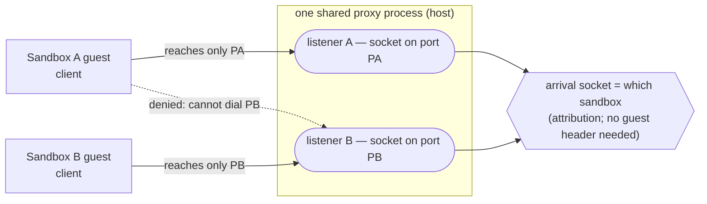
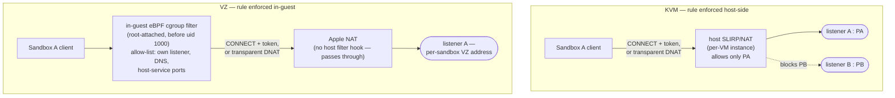
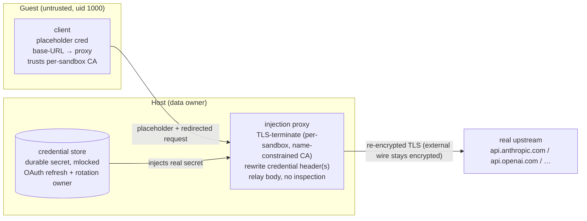
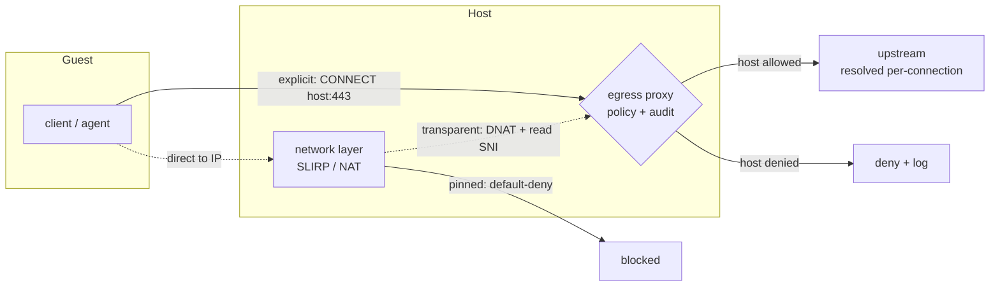

# RFC-0002: Guest network egress and credential containment

- **Status:** Accepted
- **Authors:** Cristian Spinetta
- **Created:** 2026-06-21
- **Discussion:** [PR #100](https://github.com/the-void-ia/void-box/pull/100)
- **Related ADRs:** ADR-0002, ADR-0003, ADR-0004, ADR-0005, ADR-0006

## Summary

This RFC proposes a single host-side mechanism that governs what the untrusted guest agent can reach on the network and how it authenticates to the endpoints it is allowed to reach. Both concerns are tackled together because they share one piece of infrastructure — a shared, low-privilege host proxy with a per-connection handler pipeline (`EgressPolicy`, `Tunnel`, `AuditSink`, plus a credential injector). **Egress policy** governs which destinations the guest may reach at all, how that traffic is audited, and how it is routed, via a per-sandbox profile. **Credential containment** keeps durable secrets (API keys, OAuth refresh tokens) off the guest and injects them only at the network egress that needs them. The two are orthogonal — credential containment holds under any egress profile — but they are served by the same proxy process, so this RFC specifies them as one design.

## Motivation / problem

void-box runs an untrusted agent (uid 1000, the expected adversary being prompt injection or a compromised dependency) inside a micro-VM. Two gaps in the current design expose the host operator and the operator's accounts.

**Durable credentials are staged into the guest.** The `claude-personal` and `codex` providers stage the OAuth credential — *including the refresh token* — into the guest: an RW bind-mount of the credential file at `/home/sandbox/.claude` or `/home/sandbox/.codex` (`src/runtime.rs:234-247`, `1399-1408`), or a privileged WriteFile copy (`src/agent_box.rs:464`). A uid-1000 agent can read it and exfiltrate the refresh token, yielding account access that outlives the run. Both CLIs self-refresh in-process and rotate single-use refresh tokens, so host-only ownership is the only correct design — two refreshers invalidate each other's token. API-key auth carries the same exposure, worse: the default `Claude` provider forwards `ANTHROPIC_API_KEY`, `codex` falls back to `OPENAI_API_KEY`, and `Custom` providers forward their key — all into the guest exec env (`src/llm.rs:427,474,480`), readable by uid 1000 and snapshot-captured. An API key is long-lived, non-rotating, full billing access. (Local providers — Ollama, LM Studio — pass only non-secret placeholders and are not at risk.) The common shape across all of these is one risk family: a durable secret is staged into a guest the design treats as untrusted, where the agent can read and exfiltrate it for access that outlives the run. The secrets at risk span (1) **LLM-provider credentials** and (2) **other downstream secrets** the workflow or its skills consume — a GitHub token, a Slack token, registry credentials — whichever the end user configures.

**The guest's network reach is effectively unbounded and unaudited.** Today's network layer is a SLIRP userspace stack (`src/network/slirp.rs`: guest `10.0.2.15`, gateway `10.0.2.2` → host loopback, DNS `10.0.2.3`) with stateless NAT and a deny-list (`src/network/nat.rs`: `translate_outbound` checks `Rules.deny_cidrs`, else forwards). `Rules::default()` has an empty deny-list (default-allow); `SlirpBackend::new()` seeds a `169.254.0.0/16` deny so link-local/metadata is already blocked. There is **no allow-list**, no per-name capability (translation is purely IP/CIDR-based), and **no egress audit** of destinations. The model can only block named CIDRs; it cannot restrict *to* a set, express domains, or audit. Real workflows need a spectrum of reach that none of this can express today:

- open research/browse over domains not known in advance;
- a bounded set of public services (PyPI + npm + docs);
- LLM-provider-only;
- a provider plus one or two services (e.g. `api.github.com` for a PR workflow);
- internal-only, or fully air-gapped.

They also need cross-cutting controls the current layer lacks: audit and observability, rate-limiting and a kill-switch, and data-exfiltration containment.

## Detailed design

### New components

This design adds the following components:

- **Injection proxy** (`src/proxy/`) — a host-side process that terminates the guest's TLS, rewrites the credential header with a host-held secret, and re-encrypts to the real upstream. It is where a credential enters the request, so the guest never has to hold one.
- **Credential store** — the host-side holder of each provider's durable secret (an API key, or an OAuth refresh token). It performs OAuth refresh and rotation; the durable secret never leaves it. It lives in the same low-privilege process as the injection proxy.
- **Guest placeholders** — non-secret dummy credential values staged into the guest in place of the real secret. The client sends a placeholder; the proxy substitutes the real secret at egress. This is what the guest holds *instead of* a credential.
- **Per-sandbox proxy listener** — a distinct host-side socket the host allocates for each sandbox and points that sandbox's clients at. The host-side socket a connection arrives on identifies the owning sandbox, so attribution is structural rather than dependent on any guest-supplied marker. Allocated at sandbox start and released on teardown.
- **Per-sandbox proxy token** — a random value the host generates for each sandbox and injects into the guest. The proxy checks it on every connection and strips it before forwarding upstream, so the shared proxy can tell one sandbox's traffic apart from another's and a sandbox can only act on its own behalf.
- **Per-sandbox CA** — a short-lived certificate authority the host generates for each sandbox, name-constrained to only the upstreams that sandbox is allowed to reach. Its public certificate is installed in that one guest (so the client trusts the proxy); its private key never leaves the host. The per-sandbox proxy token and the per-sandbox CA are both re-minted on snapshot restore.
- **`EgressReach`** (`src/network/nat.rs`) — the network-layer reach model (`Open` / `PinnedToProxy` / `NoEgress`) that decides, at the IP/CIDR level, whether a packet may leave the guest at all.
- **`EgressSpec`** (`src/spec.rs`) — the user-facing per-sandbox egress profile (`open` / `monitored` / `allowlist` / `proxy-only` / `none`) and its allow/deny lists.
- **`CredentialSpec`** (`src/spec.rs`) — the user-facing declaration of downstream credential injection: which upstream host gets which header, sourced from which host-side secret. LLM-provider credentials need no entry here (the provider implies the endpoint and the secret source); this is for additional services such as GitHub or an internal API.
- **`EgressPolicy` / `Tunnel` / `AuditSink`** (`src/proxy/`) — the three stages the proxy runs per connection: the name-based allow/deny decision, a CONNECT pass-through for allowed non-credentialed traffic, and the structured audit record (`EgressEvent`) respectively.
- **VZ egress filter** (`guest-agent`, eBPF) — on macOS/VZ only, a root-attached cgroup `connect4`/`connect6` (plus `sendmsg4`/`sendmsg6`) program that enforces the per-sandbox reach allow-list *inside* the guest, because Apple's NAT exposes no host-side filter hook. Attached before uid 1000 starts, so the untrusted agent cannot detach or bypass it. KVM needs no equivalent — its reach is enforced host-side in `EgressReach`.

### A. Shared infrastructure and trust model

**Trust model — single-tenant *for this feature*.** Credential containment assumes the host operator is the data owner, authorized to see all guest plaintext — the operator already owns the guest's RAM, filesystem, and network, and the injection proxy terminates TLS on the host. The guest agent (uid 1000) is untrusted. Here the untrusted party is the workload process (uid 1000); the only root in the guest is the void-box **guest-agent** binary (PID 1), which is trusted — it sets up the sandbox (on VZ, attaching the in-guest egress filter before the workload starts) and serves the control channel. The modeled adversary therefore never holds root: a uid-1000→root escalation (a guest kernel LPE, or an exploit of the guest-agent's privileged surface) is outside the primary model and is treated as a defense-in-depth concern wherever it surfaces (§C Attribution reliability, E6, R10). The design is **not** suitable as-is where the operator must not read tenant data — proxy TLS termination would expose it; that deployment needs an additional control and is out of scope. This boundary also tracks provider policy (below): a user running their own subscription is "ordinary use"; an operator routing other users' subscription credentials is not.

**Goal and invariant.** void-box lets an agent **use** credentials without **holding** the durable ones. The **invariant**: durable credentials — OAuth refresh tokens, long-lived API keys, and downstream service secrets — never enter the guest. The host holds them, performs all refresh, and is the sole rotation owner. Any token the guest holds is short-lived and host-revocable. The **proxy tier**: the guest holds no credential at all, only non-secret placeholders. API keys, downstream injection, and OAuth all use this tier.

**One shared proxy, multiplexed across sandboxes.** A single low-privilege host process serves every sandbox, rather than one proxy per VM. Sharing one process across mutually-untrusted sandboxes raises the obvious question of how it keeps them apart. Three orthogonal per-sandbox mechanisms answer it — not layered redundancy, but three separate axes, each covering a separation gap the others structurally cannot:

| Mechanism | Axis | What it does | The gap only it covers |
|---|---|---|---|
| Per-sandbox listener (distinct host socket) | Attribution | The host-side socket a connection arrives on identifies the owning sandbox (Connection attribution, below) | Transparently intercepted (DNAT'd) flows carry no header to authenticate — only the arrival socket can attribute them |
| Per-sandbox proxy token | Authentication | Proves a connection came from that sandbox's legitimate guest, not a hostile neighbor (above) | VZ, where network-layer enforcement is in-guest and so weaker than KVM's host-side enforcement — primary cross-sandbox control there, defense-in-depth on KVM, which already denies the hop at the network layer |
| Per-sandbox CA (name-constrained) | Trust scope | Limits what the proxy may impersonate to that sandbox's own upstreams (above) | Bounds the blast radius of a CA-key leak; does not separate sandboxes at all |

Because those per-sandbox mechanisms do the separating, the isolation boundary can sit between the daemon and the shared proxy rather than between one proxy process per sandbox — which is what makes one process safe to share. Its memory cost is then fixed rather than linear in VM count; a per-sandbox process, each with its own `mlock`ed store, would instead fight VM density (KSM/balloon) as instances grow. Both concerns plug into the same per-connection pipeline in `src/proxy/` — `EgressPolicy`, `Tunnel`, and `AuditSink` (egress) alongside the credential injector — built fresh in Rust (`rustls`/`hyper`) for a memory-safe parser surface.

**Connection attribution.** Telling one sandbox's traffic apart at a shared proxy cannot rely on an in-band marker, because transparently intercepted (DNAT'd) flows carry no header the guest could stamp. Attribution is instead structural, resting on **network-layer enforcement** that is default-deny and non-bypassable from the guest: the guest cannot open a socket the host did not allow. Concretely: each sandbox gets a per-sandbox proxy listener — a distinct host-side socket — and the network layer, in *every* profile including `open`, denies that sandbox any gateway hop except its own listener (plus DNS and its enabled host-service ports). That **per-sandbox rule** is what attributes traffic: a sandbox cannot open a connection to another sandbox's listener, so the socket a connection arrives on is the sandbox's identity, with no cooperation required from the guest.



The per-sandbox rule is load-bearing because the SLIRP gateway→loopback mapping preserves the port and per-VM instances share the host loopback namespace: without it, a sandbox could dial `10.0.2.2:<another sandbox's port>` and land on a neighbor's listener.

Where the rule is enforced differs by platform. On KVM each VM has its own SLIRP/NAT instance, so the rule is enforced host-side, per VM — even a fully compromised guest cannot reach a neighbor's listener. On VZ, where Apple's NAT has no host filter hook, the rule is enforced inside the guest by a root-attached eBPF cgroup connect-filter (Platform parity, §C) installed before uid 1000 runs, and the proxy binds a per-sandbox VZ-reachable address — so the barrier sits inside the guest. That holds against the uid-1000 adversary, but a uid-1000→root escalation can subvert an in-guest filter (unlike the host-side KVM path), which is why the per-sandbox token (below) is the load-bearing cross-sandbox control on VZ, not merely defense-in-depth.



Listener sockets are allocated per sandbox and released on teardown; the gateway port space bounds concurrent sandboxes, which the implementation must size against the target VM density.

**Per-sandbox token.** On top of that network-layer enforcement, each sandbox's proxy token authenticates the connection: presented as `Proxy-Authorization` on an explicit `CONNECT` and checked before any upstream connect, it proves a connection came from the legitimate guest rather than a confused or hostile neighbor, and is stripped before forwarding upstream. Where that enforcement is host-side (KVM) the token is defense-in-depth; where it is in-guest and weaker (VZ) it is the primary cross-sandbox control. Because it is also a guest-readable value on the kernel cmdline, it must be a ≥128-bit CSPRNG value, compared in constant time, and never written to a log, an `EgressEvent`, or an error surface (R15).

**Shared SSRF pin.** Server-Side Request Forgery (SSRF) — coercing the proxy into connecting to an internal target on the guest's behalf — is a risk wherever the proxy connects upstream (credential injection or an allow-listed egress destination). The proxy blocks it by resolving the name **once**, pinning that exact IP for the connection (no connect-time re-resolve), and rejecting any IP in the baseline-deny set: RFC-1918, link-local/metadata (`169.254.0.0/16`), IPv6 ULA/`::1`, CGNAT (`100.64.0.0/10`), and the SLIRP gateway→host-loopback mapping. This baseline applies in every egress profile and to every credentialed flow (R3; the egress side states this as the "SSRF-pinned" property in §C).

**Provider terms of service.** The mechanism choice is constrained by provider policy, not only by security. **API keys are the sanctioned path for programmatic use.** Anthropic's policy states OAuth "is intended exclusively for … ordinary use of Claude Code and other native Anthropic applications," that developers "building products or services … should use API key authentication," and that Anthropic "does not permit third-party developers … to route requests through Free, Pro, or Max plan credentials on behalf of their users" ([Claude Code legal & compliance](https://code.claude.com/docs/en/legal-and-compliance); [Anthropic Consumer Terms](https://www.anthropic.com/legal/consumer-terms); [Usage Policy](https://www.anthropic.com/legal/aup)). OpenAI similarly restricts programmatic ChatGPT-subscription use, tolerating personal use of the official codex CLI on one's own subscription ([OpenAI Terms](https://openai.com/policies/row-terms-of-use/); [Usage Policies](https://openai.com/policies/usage-policies/)). So the **API-key proxy path carries no policy tension** — programmatic/proxied use is the intended use of an API key.

**Personal-subscription OAuth is "ordinary use" only when single-tenant.** A user running their own subscription through the real Claude Code/codex is ordinary use; an operator routing other users' subscription credentials is the prohibited pattern — the same boundary as the trust model. void-box must not be deployed as a multi-tenant service over subscription credentials; such deployments use API keys.

**Containment-vs-policy tradeoff for personal OAuth.** Host-side refresh/injection means the OAuth token is used by the host store, not strictly by Claude Code — the ambiguous boundary of "ordinary use of Claude Code." Today's mount keeps the token's use inside the client but leaks the refresh token. For personal subscriptions this is a tradeoff the user owns; the policy-clean path for anything programmatic is API keys.

This is a reading of public policy, not legal advice; operators should consult the linked terms for their use case.

Provider behaviors in this RFC are confirmed against Claude Code 2.1.170 and openai/codex 0.140.0 (pre-release `rust-v0.140.0-alpha.2`). The bundled versions (`scripts/agents/manifest.toml`) currently differ — claude-code 2.1.143, codex 0.137.0 — so re-verify these behaviors against the bundled binaries before relying on them, and on every version bump (R9).

### B. Credential containment

**Mechanism: the host injection proxy.** A host-side, TLS-terminating, header-injecting proxy, backed by the credential store, is the single committed mechanism for all credential delivery — API keys and OAuth alike. The proxy a client is pointed at is this sandbox's own per-sandbox listener, subject to the same per-sandbox rule as all egress (§A). Only the clients that need a host-held credential are pointed at it (selective routing — the default; restrictive egress profiles route all traffic through the same proxy, §C); the client trusts a per-sandbox CA installed in the guest (name-constrained to the injected upstreams, so it can't impersonate arbitrary sites), the proxy rewrites the credential header(s) with the host-held secret, and forwards to the real upstream. The guest holds only placeholders (non-secret dummy values the proxy replaces).



**Credential store.** Holds each provider's durable secret — read from `~/.claude`/`~/.codex`/Keychain, or the host env for API keys. For OAuth it refreshes against the provider's token endpoint and mints short-lived access tokens **lazily on first use, overlapped with VM boot** — never a serial pre-boot RTT. It is the sole rotation owner: refreshes are serialized and rate-capped. And it **persists the rotated refresh token back to the host**, so subsequent runs stay valid. Write-back must be atomic (temp + `rename`), `0600`, and locked across any processes/runs sharing the durable credential file — a corrupt or raced write loses the single-use refresh token and can lock the account out (R12). Secrets live only here, in host memory, `mlock`ed, zeroized via `secrecy`, and shielded from core dumps (`PR_SET_DUMPABLE=0`).

**Why TLS termination, and why it is safe.** The credential header lives inside the TLS stream; rewriting it requires terminating TLS. Under the trust model this exposes nothing new — the host already sees the guest's data. The proxy streams bodies through without inspecting them, re-establishes TLS to the upstream (the external wire stays encrypted), and trusts only a per-sandbox CA installed in the guest image (a scoped trust, not general interception). The one non-transparent effect: the upstream sees the proxy's TLS fingerprint, not the client's (R7).

**API keys (`Claude`, `codex` env-key, `Custom`).** A static secret: the proxy injects `x-api-key` (Anthropic) or `Authorization: Bearer` (OpenAI/codex; the Custom provider's configured header). No refresh, no rotation, no policy tension. codex API-key mode targets `api.openai.com/v1`, redirected the same way.

**OAuth via the proxy (Claude/codex ChatGPT).**

- Claude: `ANTHROPIC_BASE_URL=<proxy>`, `NODE_EXTRA_CA_CERTS=<CA PEM>`, `CLAUDE_CODE_PROVIDER_MANAGED_BY_HOST=1` (suppresses the hardcoded OAuth-refresh recovery and force-login), placeholder `ANTHROPIC_AUTH_TOKEN`, no credentials file. Only `/v1/messages` blocks and it honors the base URL.
- codex: `openai_base_url=<proxy>` + `credentials_store="file"` in `$CODEX_HOME/config.toml`, `CODEX_CA_CERTIFICATE=<CA PEM>`, and a placeholder `auth.json` (dummy `id_token`, placeholder `access_token`/`account_id`, recent `last_refresh`). The proxy injects the real Bearer and `ChatGPT-Account-ID` (real identity stays host-side) and passes `originator` through. codex defaults to Responses-over-WebSocket — force plain HTTPS (`supports_websockets=false`) or inject on the WS upgrade (R8).

Neither client pins certificates; both honor an additive CA via the env above (PEM file; not `SSL_CERT_DIR`).

**OAuth through the proxy: feasibility and contingency.** The proxy is the single mechanism for OAuth providers as well as API keys. OAuth carries feasibility risks the API-key path does not: the token endpoint may reject a refresh grant replayed by the host store rather than the genuine client (token binding/DPoP/attestation; R4), and because the proxy terminates TLS the provider sees the proxy's fingerprint under a `claude-code`/`codex` user-agent, which anti-abuse heuristics on a *personal* subscription may flag or ban (R6, R7). Validation (V2 plus the ToS/detection check) retires these before OAuth ships through the proxy; the durable-secret-stays-host-side invariant holds regardless, via API keys for programmatic use. This residual feasibility risk is tracked as R13. **Contingency — token injection (not designed here).** If validation shows proxying a personal subscription is not viable, the alternative to evaluate is *token injection*: mint a short-lived access token host-side and hand it to the genuine client (an inherited file descriptor for Claude, a loopback shim for codex) so the client makes an end-to-end-TLS call with its own fingerprint, accepting a bounded short-lived token at rest in the guest. It never applies to API keys (a static key cannot be minted short-lived). We do not build it unless that validation forces it.

**Downstream credential injection.** Some named downstream services need a host-held secret injected (e.g. a GitHub token for `api.github.com`). The same proxy injects it: the service is routed to the proxy by **explicit client config** (a `git` credential helper, or a scoped `HTTPS_PROXY` for that host), and the proxy rewrites the auth header with the host-held credential. These are usually static secrets (no OAuth refresh). The proxy injects a credential only on **exact upstream host+path match**, never on agent-controlled redirects or `Host` headers, and follows no credentialed redirects (R3).

**Downstream credential configuration.** Per-destination injection is declared in a `CredentialSpec` (`src/spec.rs`), resolved in `src/runtime.rs` with a per-box override (`BoxSandboxOverride`), mirroring `EgressSpec`. Each entry binds an upstream host to a header the proxy writes and a host-side secret source:

```yaml
credentials:
  downstream:
    - host: api.github.com          # exact host (matchName); optional `path:` prefix narrows further
      inject:
        header: Authorization        # the header the proxy writes upstream
        format: "Bearer {secret}"    # {secret} is substituted with the host-held value
      secret:
        env: GITHUB_TOKEN            # host source — exactly one of: env | file | keychain
```

The secret is resolved on the host at run start through `src/credentials.rs` (an `env` variable, a `file` path, or a `keychain` entry) and held only in the credential store; it is never staged into the guest, the same invariant the LLM-provider path obeys. The guest sends only a placeholder, and provisioning points the relevant client at the proxy for that host (a `git` credential helper for `git`, or a scoped `HTTPS_PROXY` for the host's other tools). Matching is **exact** — `matchName` host plus an optional `path` prefix, no wildcard — deliberately tighter than the egress allow-list, so a credential is injected only on an unambiguous upstream (R3).

Composition with egress: declaring a downstream credential makes its host reachable through the proxy and recorded in the egress audit, so an injected host need not be repeated in an `allowlist` profile's `allow` set, and `proxy-only` admits exactly the credentialed hosts (the LLM providers plus these entries). `none` forbids external egress, so pairing it with any `credentials.downstream` entry is a config error rejected at parse time, alongside the `none`+cloud-provider rule (both introduced by this RFC — `src/spec.rs` has no egress concept today). Each `secret` source must resolve at run start or the run fails fast — a missing `GITHUB_TOKEN` is an error, not a silent unauthenticated call.

**Credential security properties.**

- **Durable secret never in the guest** — refresh tokens and API keys are held and rotated only on the host.
- **No credential at all in the guest** — only non-secret placeholders.
- **Single rotation owner** — only the host refreshes, removing the rotation-conflict failure mode.
- **Bypass-safe containment** — a guest ignoring the proxy/injector cannot obtain a credential (a direct call to the upstream carries no valid token).
- **External wire stays encrypted** — for the proxy, TLS is re-established to the upstream; only a host-internal hop is plaintext.
- **Opt-in** — no behavior change for providers that do not stage a credential.

**Residual:** the durable secret now lives in host process memory for the run (vs. today's 0600 temp file dropped on teardown) — a wider host-side surface on a shared host, mitigated by `mlock`/zeroize and per-sandbox process isolation; the host decrypts inference traffic (trust-model dependent); a hot-path availability coupling; the per-sandbox proxy token is guest-readable (use, not theft — guards against neighbors, not the in-guest adversary).

**Guest provisioning (cold boot).** At cold boot the host delivers the sandbox's proxy coordinates and trust material into the guest — the counterpart to the restore path below. The proxy endpoint (the `gateway:port` of the sandbox's listener) and the per-sandbox proxy token go on the kernel cmdline, alongside the existing `voidbox.*` parameters (`voidbox.proxy=…`, `voidbox.proxy_token=…`); the per-sandbox CA public certificate is written into the guest as a file that guest-agent provisioning points the clients at through the additive trust path they honor (`NODE_EXTRA_CA_CERTS`, `CODEX_CA_CERTIFICATE`), never baked into the image. The token is guest-readable by design — it authorizes use and is not a durable secret — so the cmdline is an acceptable carrier; the CA private key and every durable secret stay in the host proxy process. On restore the resumed guest does not re-read the cmdline, so the same three are re-minted and pushed over the control channel instead (below).

**Snapshot / restore.** Restore brings the guest back from a full memory image, so it returns holding whatever it had at capture — that part is by design. The concern is **per-sandbox auth material**: the restore path reuses the snapshot's stored vsock session secret verbatim rather than minting a fresh one (`src/vmm/mod.rs:646-665` — only the socket-path `runtime_id` is regenerated), and a snapshot-delivered proxy token or CA would otherwise be carried into every restored instance, defeating "per-sandbox ephemeral" for them (R11).

**Re-minting the proxy material.** On restore the host generates a fresh per-sandbox CA and proxy token. A client *launched after* restore picks them up through the normal cold-boot provisioning path, and the new proxy stops honoring the snapshot's old token. A client that was *already running* at capture holds the old CA and token in restored RAM and will not re-trust fresh material without a restart — rewriting an env/PEM file does not change a running process's loaded trust store. So for in-flight credentialed clients, credentialed egress fails closed rather than reusing stale material; a live-reload path (a signal or restart, confirmed per client) is left as a future probe (Unresolved questions).

**Keeping CA material out of the snapshot.** The CA private key and the credential store live only in the host proxy process — never in guest RAM, the cmdline, or `src/vmm/snapshot.rs` state — so they are structurally absent from any snapshot. Only the CA public cert is ever in the guest, and it is replaced for post-restore clients.

**Snapshot confidentiality.** Because the proxy token and CA are re-minted, a leaked snapshot grants no proxy or credential access. What it does expose is the guest RAM (which for a not-yet-migrated provider may still hold a real credential — R14) and the reused vsock session secret, which authenticates a host-local control channel. The snapshot file is therefore a confidential artifact — stored host-operator-only (`~/.void-box/snapshots/`, restrictive perms) — and the reused session secret is tracked separately in [#95](https://github.com/the-void-ia/void-box/issues/95).

### C. Egress policy and profiles

Egress policy governs which destinations the guest may reach at all, how that traffic is audited, and how it is routed — independent of whether a credential is injected.

**Settled decisions.**

- **Default profile `open`** — direct egress via NAT (minus the baseline metadata/RFC-1918 deny), with only credentialed flows traversing the proxy; preserves the cold-boot budget and current behavior, and audit/allow-listing are opt-in.
- **One shared proxy** (above) — egress reuses it rather than a second process.
- **`monitored` is destinations-only** — a CONNECT-tunnel where the proxy sees and audits the destination (CONNECT host / SNI) but never decrypts content; no guest-trusted CA is introduced for egress (content inspection / TLS-MITM / DLP is a non-goal).
- **Allow-list vocabulary is Cilium `toFQDNs`** — `matchName` (exact) + `matchPattern` (wildcard `*` that does not cross `.`, so `*.x.com` ≠ `x.com`).
- **Profile-enum policy model** — redesign `Rules` around a profile enum rather than extending the CIDR deny-list.

**Prior art adopted.** The design follows established egress-firewall conventions rather than a bespoke DSL: Stripe Smokescreen (HTTP CONNECT egress proxy — default-deny hostname allow-list, `report` vs `enforce` modes, resolve-then-block-internal-IP SSRF protection); Cilium `toFQDNs` (the matching vocabulary); Istio `OutboundTrafficPolicy` (`REGISTRY_ONLY` vs `ALLOW_ANY` — the profile framing, where `allowlist`/`proxy-only` ≈ REGISTRY_ONLY and `open` ≈ ALLOW_ANY); AWS Network Firewall (domain allow/deny on TLS SNI / HTTP Host — the same enforcement signal); and `HTTPS_PROXY`/`NO_PROXY` (the de-facto routing convention). From these: a default-deny allow-list of FQDNs with wildcards as the user language; `report` then `enforce` (run `monitored`, harvest the destinations a workflow used, promote to an `allowlist`, switch to enforce); and the SSRF resolve-and-block-internal baseline.

**Profiles.** Egress is a **per-sandbox profile** (a closed enum), set in the spec, defaulting to `open`:

| Profile | Reach | Routing | Audit |
|---|---|---|---|
| `open` (default) | full internet, direct | direct via NAT (baseline metadata/RFC-1918 deny) | none |
| `monitored` | full internet | all egress CONNECT-tunneled via the proxy (destinations seen, content not decrypted) | full (destinations, volume) + rate-limit + kill-switch |
| `allowlist` | only listed domains (+ any credentialed endpoints) | via the proxy, gated by hostname | full |
| `proxy-only` | credentialed endpoints only (LLM providers) | via the proxy | full |
| `none` | no external egress (local providers only) | n/a | n/a |

`none` is valid only with local providers (Ollama, LM Studio); pairing it with a cloud LLM provider is a config error rejected at parse time.

**`EgressSpec` (config).** `EgressSpec` in `src/spec.rs`, resolved in `src/runtime.rs` with a per-box override (`BoxSandboxOverride`), mirroring `LlmSpec`:

```yaml
egress:
  mode: allowlist        # open | monitored | allowlist | proxy-only | none
  allow:
    - api.github.com     # exact host (matchName)
    - "*.pypi.org"       # wildcard (matchPattern; does not match pypi.org itself)
  deny:                  # optional extra CIDRs; the metadata/RFC-1918 baseline is always denied
    - 203.0.113.0/24
  limits:                # optional; defaults inherit the SLIRP connection limits
    max_connections_per_second: 50
    max_concurrent_connections: 64
```

`allow` is honored only by `monitored`/`allowlist` (it is the enforce set for `allowlist`, the report context for `monitored`); `open`/`proxy-only`/`none` ignore it.

**Override semantics.** A box-level `egress` or `credentials` block, when present, replaces the corresponding top-level block wholesale for that box rather than merging into it — the same precedence the per-box snapshot override already uses. Merging allow-lists across levels would produce exactly the ambiguous, hard-to-reason-about combinations the data-model conventions warn against. So each box resolves to a single effective spec: its own block if it has one, otherwise the top-level default. A box may therefore tighten or loosen independently of the top level. Two things hold regardless of level: the baseline deny always applies and cannot be overridden away, and the `none`+cloud-provider and `none`+downstream-credential validations run on the effective post-override config.

**How a request reaches the proxy.** Enforcement never depends on the client cooperating: `HTTPS_PROXY` is a convenience; enforcement is at the network layer. A request reaches the proxy by one of two routes:

- **Explicit (cooperative).** Clients that honour `HTTPS_PROXY` (curl, git, pip, npm) issue `CONNECT <host>:443`; the proxy reads the hostname, applies policy, and tunnels the client's end-to-end TLS to the upstream — no decryption, no CA. Preferred: the hostname is explicit and survives Encrypted-SNI.
- **Transparent (catch-all).** Traffic that does not use the proxy — a client ignoring `HTTPS_PROXY`, or a bypass attempt — is redirected to the proxy by the network layer (DNAT), which recovers the destination from the TLS SNI and applies the same policy.

A client that omits `HTTPS_PROXY` and one that deliberately bypasses it are indistinguishable at the network layer and treated identically. In the restrictive profiles the network layer default-denies every destination except the proxy (pinning), so a non-cooperative client is either transparently captured or cannot egress at all.



**Protocol and address scope.** HTTPS on 443 is the primary path: the proxy keys policy on the CONNECT host or the TLS SNI. Plain HTTP on 80 is policed in the routed profiles by the `Host` header against the same allow-list, with the caveat that plaintext carries no confidentiality and is admitted only if the host passes policy. The proxy matches policy by hostname regardless of port, but the network layer only redirects 80 and 443 to it. Traffic to other ports is governed by the coarse reach alone — allowed under `open` (minus the baseline), denied under the restrictive profiles. Arbitrary named TCP on non-web ports stays the deferred SOCKS5 extension. IPv6 egress is denied by default in this iteration: the guest is IPv4-only over SLIRP today and `10.0.2.3` serves A records, so the baseline already blocks IPv6 and AAAA/IPv6 policing is a future extension rather than a half-enforced path.

**Two enforcement layers.** Reach is enforced at two layers:

- **Network layer (`nat.rs`/`slirp.rs`) — coarse reach + pinning.** Enforces the profile's reach: `open` = allow-all internet minus the baseline deny, with gateway access restricted to this sandbox's own proxy/DNS/host-service ports (the per-sandbox rule, §A); the restrictive profiles = default-deny, pinning the guest to its own proxy listener (that listener, DNS, and its enabled host-service ports reachable). CIDR/port-level only. Pinning is enforced **independently of proxy liveness** — if the proxy crashes, restrictive profiles fail closed (egress denied), never open.
- **Proxy layer — fine-grained, name-based policy + audit.** For routed traffic (`monitored`/`allowlist`/`proxy-only`) the proxy enforces the domain allow-list by hostname (CONNECT host / SNI), produces the audit log, applies rate-limits, and is the kill-switch. Credentialed endpoints hand off to the injection path; plain allow-listed endpoints are CONNECT-tunneled (no TLS termination, no CA).

**Why the proxy matches names while the network layer matches IPs:** a domain resolves to many rotating CDN IPs, so a CIDR allow-list can't keep up. The proxy resolves each name per connection, so it always reaches a currently-valid IP for an allowed name, and the guest never deals in IPs.

**Host-service exemption.** A guest legitimately reaches host-side services on the SLIRP gateway (`10.0.2.2`) that are not internet egress: the messaging sidecar and a local LLM provider (Ollama / LM Studio). These are trusted infrastructure the operator started, so the restrictive profiles exempt them from pinning rather than route them through the proxy — `PinnedToProxy` additionally allows the specific gateway:port hop of each *enabled* host service (the sidecar port when messaging is on; the local-provider port when the provider is local), and that hop keeps its direct gateway→loopback path. The exemption is narrow: just the single enabled-service port, and only for that sandbox — never a blanket gateway allow. The per-sandbox rule (§A) still denies a sandbox every gateway port but its own. So one sandbox cannot reach a neighbor's sidecar or provider over the shared loopback, and the SSRF baseline blocks every other internal range. A host service so exempted must bind a per-sandbox address or enforce per-sandbox authorization itself, since the per-sandbox proxy token does not guard it (it sits beside the proxy, not behind it). Proxying these instead would add per-byte cost on the hottest local path (model token streaming) and make the agent's model and messaging depend on proxy liveness, for no gain against an internet-egress threat. The audit sink records each exempted hop as a `host-service` event, so `monitored` stays honest about what bypassed the proxy. (void-mcp needs no exemption: it runs inside the guest on loopback and never crosses the network layer.)

**The shared proxy pipeline.** Egress plugs into the existing per-connection pipeline (`src/proxy/`): `EgressPolicy::decision(host)` replaces the Phase-0 `AllowAllPolicy` with the FQDN allow-list engine (deny → `403` + audit, before any upstream connect); `Tunnel` is, for allow-listed non-credentialed destinations, a CONNECT pass-through that does not terminate TLS (distinct from the credential path, which terminates TLS to inject; selected when no injector owns the host); `AuditSink::record(EgressEvent)` replaces the Phase-0 `DebugAuditSink` with the structured sink. Routing is **selective** when the profile is `open` (only credentialed flows traverse the proxy) and **full** when `monitored`/`allowlist`/`proxy-only` (all egress is pinned to the proxy). The same component serves both.

**Network-layer policy (`src/network/nat.rs`).** Replace the deny-only `Rules` with a profile-driven reach model (the credentialed `open` deny-list folds in as the baseline):

```rust
enum EgressReach {
    /// `open`: allow all internet, minus `baseline_deny` (always) and operator
    /// `deny`; gateway hops restricted to this sandbox's own proxy port, DNS, and
    /// enabled host-service ports (the per-sandbox rule, applied in every profile).
    Open,
    /// `monitored` | `allowlist` | `proxy-only`: deny all except this sandbox's
    /// proxy listener, the SLIRP DNS, and its enabled host-service ports.
    PinnedToProxy { proxy_port: u16 },
    /// `none`: deny all external; only the local-provider gateway hop is allowed.
    NoEgress,
}
```

`translate_outbound` per reach:

- **Open** — deny if the destination is in `baseline_deny` (metadata `169.254.0.0/16`, RFC-1918, link-local, IPv6 ULA/`::1`, CGNAT `100.64.0.0/10`) or operator `deny`; restrict gateway (`10.0.2.2`) connections to this sandbox's own proxy listener port, DNS (`10.0.2.3`), and its enabled host-service ports — so a sandbox cannot reach another sandbox's listener over the shared loopback (see Connection attribution); otherwise forward.
- **PinnedToProxy** — allow only the hop to this sandbox's own proxy listener port, DNS to `10.0.2.3`, and the gateway:port hop of each host service enabled for this sandbox (see Host-service exemption); deny everything else (network-layer enforcement, independent of proxy liveness).
- **NoEgress** — allow only the configured local-provider gateway hop; deny all else.

Existing `deny_cidrs` callers migrate to constructing `Open { deny }` with the baseline folded in. The baseline deny applies in every profile.

**DNS lockdown (`src/network/slirp.rs`).** In the pinned profiles, DNS is forced through `10.0.2.3` only: UDP/TCP 53 to any other address is denied, and DoT (853) is denied. DoH cannot egress because 443 to anything but the proxy is already denied. This ensures names are resolvable only via the path the proxy controls, closing DNS as a side channel.

**Domain policy engine (proxy).** Matching uses Cilium semantics — `matchName` (exact, case-insensitive) and `matchPattern` (`*` matches one label and does not cross `.`); the operator `allow` list is compiled once per sandbox. Per-connection resolution + SSRF pin (shared with §A): resolve the allowed name, cache short-TTL (mirroring the SLIRP resolver's 60 s), pin the resolved-and-validated IP for the connection, reject any IP in the baseline-deny set; resolve once, never connect-time re-resolve. ECH / encrypted-SNI: if SNI is unavailable, fall back to the DNS-learned-IP allow-set for the connection; if that cannot establish the destination, fail closed in the restrictive profiles.

**Audit / observability (`src/observe/`).** Each decision emits a structured `EgressEvent` { destination host, port, bytes up/down, start/end, allow/deny, whether credentialed, whether a host-service exemption } through the structured logging pipeline (`StructuredLogger`) to the configured host sink — off by default under `open`, on under the routed profiles. No payloads or credentials are logged. The audit stream is the source for `report`-mode allow-list harvesting: `voidbox egress report <run>` reads it and emits a deduplicated `allow:` list ready to paste into an `EgressSpec`.

**Attribution reliability.** Audit attributes each flow to the sandbox whose listener it arrived on (Connection attribution, §A), so it is exactly as reliable as that per-sandbox binding. Against the modeled adversary — uid 1000, which never holds root (the only root is the trusted guest-agent, §A) — the binding holds on both platforms: the eBPF filter is a full boundary on VZ, so VZ audit attribution is reliable. The residual is **beyond** that model: only if uid 1000 *escalates to root* via a separate kernel or guest-agent exploit could it, on VZ, subvert the in-guest filter — and then credentialed flows still authenticate via the per-sandbox token (so their attribution survives), while transparent (tokenless) egress could go unaudited or be logged as a neighbor's. That residual is bounded to **misattribution**, not a policy bypass: a root-escalated guest can already drop its own in-guest filter and egress directly (VZ has no host-side egress control), so routing through a neighbor's listener reaches nothing it could not reach directly — even a neighbor with a more permissive allow-list adds no destination, and that listener still applies its own allow-list and the SSRF pin. The only effect is that the flow is attributed to the neighbor rather than the attacker. On KVM even a root-escalated guest cannot do this, because enforcement is host-side; on VZ there is no host hook to recover it, though the micro-VM still contains the escalation to that one sandbox's VM. This is defense-in-depth against a stronger-than-modeled attacker, not a path open to the assumed adversary (E6).

**Rate-limit / kill-switch.** Per-sandbox egress caps reuse the SLIRP `max_connections_per_second` / `max_concurrent_connections` machinery, extended with a runtime kill-switch on the proxy handle that fails subsequent egress closed without tearing down the sandbox.

**Failure surfacing.** Failures are explicit and fail closed. On the explicit CONNECT/HTTP path the proxy returns a distinguishable status — `403` for a policy deny, `502`/`504` for an upstream or credential failure — and on the transparent path, which has no HTTP response channel, it resets the connection; either way the reason is recorded in the audit log and a host `WARN`. A credential failure (a refused refresh, an unavailable store) never falls back to an unauthenticated call — extending the downstream rule above to every credentialed flow — so the agent sees a clear error rather than a silent loss of authentication.

**Transparent interception.** The network layer does only coarse pin-to-proxy (a CIDR check). **All SNI parsing happens in the proxy process, never in the per-network-namespace SLIRP relay loop** — the same untrusted-input surface as the credential proxy, in the same separate low-privilege process.

**Platform parity.** The reach enforcement point differs by backend. On KVM, void-box runs its own userspace SLIRP/NAT (`nat.rs`/`slirp.rs`), so enforcement is **host-side** in `EgressReach` (above) — outside the guest, bypass-resistant even against a fully compromised guest. VZ has no such point: it attaches Apple's NAT directly, which exposes no host-side filter hook and puts every VM on one shared segment with a single gateway and no per-sandbox host address (so per-sandbox isolation cannot be done host-side by binding, either). VZ enforcement is therefore **in-guest**: a root-attached eBPF cgroup `connect4`/`connect6` program (plus `sendmsg4`/`sendmsg6` for unconnected UDP) allow-lists egress by destination `(address, port)` and denies the rest with `EPERM`, and a `connect4` destination rewrite redirects allowed-but-uncooperative flows to the proxy — the in-guest equivalent of the KVM DNAT. The required kernel support (`CONFIG_CGROUP_BPF`, cgroup v2) is already present on both the production VZ kernel and the dev/test slim kernel, so no kernel rebuild is needed. The root guest-agent attaches the program and places the uid-1000 agent in the filtered cgroup before dropping privileges; uid 1000 holds none of `CAP_BPF`/`CAP_NET_ADMIN`/`CAP_NET_RAW`, so it cannot detach the program, escape the cgroup, or open raw sockets around it — against the expected adversary this is a boundary, not merely defense-in-depth. A uid-1000→root escalation can still subvert it (E6). The proxy listener binds a VZ-reachable address, not loopback. Pinning, proxy reachability, and uid-1000 bypass-resistance are validated on both platforms.

**Egress security properties.**

- **Bypass-resistant** — restrictive profiles default-deny at the network layer; the guest cannot open a socket to an arbitrary IP, so it cannot sidestep the proxy.
- **Fail-closed** — pinning is enforced independently of proxy liveness; a proxy crash denies egress rather than opening it.
- **DNS confined** — only `10.0.2.3` resolves; no out-of-band resolver or DoH/DoT.
- **No content decryption** (`monitored`/`allowlist`) — CONNECT-tunnel; the proxy sees destinations, not content.
- **SSRF-pinned** — resolve-once, pin the IP, reject internal ranges.
- **Parser surface contained** — SNI/HTTP parsing is in the separate low-privilege proxy process, never in the relay loop.

### Performance

void-box gates cold boot at p50 ≤ 252 ms (≤ 400 ms threshold) and values VM density; this design must not regress either. Four cost areas, and how each is held:

- **Per-byte crypto on the inference stream** — the credential proxy terminates TLS and pays per-byte crypto on both legs of the busiest flow. It is mitigated by re-originating without parsing the body (no content/DLP inspection by default), so the cost is symmetric encryption, not inspection. The egress CONNECT-tunnel avoids per-byte crypto entirely (no termination).
- **Shared proxy** — fixed memory cost, not linear in VM count (vs. a per-sandbox `mlock`ed store fighting density).
- **Cheap startup** — an ECDSA P-256 per-sandbox CA (keygen is on the cold-start budget), installed via the additive env-var/single-PEM path (no `ca-certificates`/initramfs rebuild). OAuth refresh is lazy on first use, overlapped with boot, never a serial pre-boot RTT. Add this feature to the startup-bench gate.
- **Routing cost** — paid only by `monitored`/`allowlist` (full routing); the default `open` keeps selective routing for credentialed flows only.

## Alternatives considered

**Token injection instead of a TLS-terminating proxy (for credentials).** Mint a short-lived access token host-side and hand it to the genuine client (inherited fd for Claude, loopback shim for codex), so the client makes an end-to-end-TLS call with its own fingerprint. This avoids the proxy's TLS fingerprint mismatch (R7) and host-side refresh-acceptance risk (R4/R5), but accepts a bounded short-lived token at rest in the guest and never applies to API keys (a static key cannot be minted short-lived). Kept as a **contingency** if validation (V2) shows proxying a personal subscription is unviable (R13); not built otherwise.

**Per-sandbox proxy/store process instead of one shared process.** A process per sandbox would isolate sandboxes by the process boundary between one proxy and the next, but fights VM density: each carries its own `mlock`ed store, and memory cost grows linearly with VM count (KSM/balloon pressure). The shared process instead keeps the only process boundary between the daemon and the proxy, with the per-sandbox token + name-constrained CA isolating sandboxes; memory cost stays fixed. Per-sandbox is revisited only if a tenant-isolation requirement forces it.

**VZ reach enforcement: in-guest eBPF vs nftables vs a host userspace stack.** VZ has no host-side filter hook (Apple's NAT, §C), and its NAT puts every VM on one shared segment with no per-sandbox host address — so per-sandbox isolation cannot be done host-side by binding, and source IP is unsafe to authorize on (ARP-spoofable). Three mechanisms could supply the floor in-guest or replace the NAT. **Host userspace stack (gvproxy-style):** replacing Apple's NAT with a host-side userspace TCP/IP stack (as podman/lima/vfkit do) would put enforcement outside the guest, bypass-resistant even against a guest-root compromise, closing the E6 residual and the audit-attribution gap and unifying both backends. It is the correct long-term answer but a networking rework with its own performance and host-dependency surface; deferred to a separate RFC. **In-guest nftables:** a stateless default-deny `output` allow-list — declarative and auditable, no conntrack — but adds a ~5 MiB static `nft` binary plus modules to the image and needs `CONFIG_NF_TABLES` enabled in the dev/test slim kernel. **In-guest eBPF `connect4` (chosen):** the required `CONFIG_CGROUP_BPF` + cgroup v2 are already present on both kernels (no rebuild), the footprint is a tens-of-KB program rather than a megabytes-large binary, and `connect4`'s destination rewrite supplies the transparent pin-to-proxy that VZ otherwise lacks (no host DNAT). Its limits — connect/`sendmsg`-only coverage and per-cgroup scope — are bounded by the threat model: uid 1000 holds no `CAP_NET_RAW`/`CAP_BPF`/`CAP_NET_ADMIN`, so it cannot raw-socket around the filter, detach it, or escape the cgroup. Against a guest-root compromise eBPF and nftables are equally subvertible (only the host stack is not), so eBPF's lower cost and built-in redirect decided it for this iteration.

**Fork an existing egress firewall (Smokescreen, mitmproxy) instead of building in Rust.** Smokescreen and mitmproxy implement much of the CONNECT-proxy + allow-list + SSRF-block behavior. Building fresh in Rust (`rustls`/`hyper`) was chosen because the egress proxy and the credential injector share one per-connection pipeline and one process; bolting a second-language sidecar onto the credential path would duplicate the parser surface, the lifecycle, and the snapshot/restore handling. The conventions from those tools are adopted (prior art above) without their runtime.

**FQDN allow-list vs. CIDR allow-list.** Extending the existing CIDR deny-list to an allow-list was rejected: a domain resolves to many rotating CDN IPs, so a CIDR allow-list cannot keep up and pushes IP-handling onto the guest. Name-at-the-proxy (Cilium `toFQDNs` vocabulary) resolves per connection and keeps the guest out of the IP business.

**TLS-MITM for egress (content inspection / DLP).** Terminating TLS on general egress to inspect content would require a broad guest-trusted CA and per-byte inspection cost on all traffic. Rejected: `monitored` is destinations-only (CONNECT-tunnel, no egress CA). The credential path terminates TLS only for the specific endpoints it injects into, under its own trust model. DLP is an explicit non-goal (Unresolved questions).

## Risks & trade-offs

Severity is in-column.

### Credential containment

| # | Risk | Likelihood | Impact | Mitigation / fallback |
|---|------|-----------|--------|-----------------------|
| R1 | **Proxy streaming/lifecycle correctness** — TLS-terminate + SSE + WS + backpressure + reuse + fail-closed, on every routed call; a bug degrades all output. | Medium | High | Standard reverse-proxy patterns + dedicated streaming tests; primary engineering budget. Proxy path only. |
| R2 | **CA private-key custody / blast radius** (proxy) — a leaked CA key impersonates sites to the guest. | Low | High | **Per-sandbox ephemeral CA**, **Name-Constrained** to the injected upstreams, generated at boot and destroyed on teardown; the private key never reaches the guest, the cmdline, or a snapshot (R11). Confirm each client **enforces** name constraints (V1) — a client that ignores them turns the CA into a universal MITM anchor. |
| R3 | **SSRF / confused-deputy** via the credential-injecting proxy — the proxy coerced into connecting, and injecting a secret, to a target the guest chose. | Medium | Medium–High | Exact host+path injection match; no credentialed redirects; no agent-controlled `Host`; resolve **once** and pin that exact IP for the connection (no connect-time re-resolve); reject RFC-1918/link-local, IPv6 ULA/`::1`, CGNAT `100.64/10`, and the SLIRP gateway→host-loopback mapping. |
| R4 | **Host-side OAuth refresh acceptance** — the token endpoint accepting an off-client refresh (refresh grant has no PKCE, but tokens could be binding-bound). | Low–Med | Medium–High | Confirm in V2 (throwaway). Evidence: standard refresh shape, plain Bearer, no DPoP observed; same egress IP via NAT. |
| R5 | **Inference acceptance of a host-supplied subscription Bearer.** | Low–Med | Medium–High | V2. Precedent: `CLAUDE_CODE_OAUTH_TOKEN` is an externally-supplied subscription Bearer the inference endpoint accepts. |
| R6 | **Provider ToS** — personal-subscription OAuth used outside the native client, or multi-tenant routing of subscription credentials, is restricted. | — | High (policy) | API keys for programmatic/hosted use; personal-OAuth is single-tenant ordinary use, user-owned (see ToS section). |
| R7 | **TLS fingerprint** — proxy termination changes the upstream-visible JA3/JA4; on subscription endpoints a client mismatch could be a signal. | Low | Low–Med | Low signal on API endpoints (diverse clients expected); uTLS-style impersonation if needed. |
| R8 | **codex WebSocket transport** vs header injection. | Low | Low–Med | Default `supports_websockets=false` (plain HTTPS); inject-on-upgrade optional. |
| R9 | **Provider version drift** changing redirect/refresh/header/transport behavior. | Low | Low–Med | Pin versions; re-verify V1/V2 facts on bump (bump workflow gates it). |
| R10 | **Guest→host parser surface** — the proxy parses attacker-controlled HTTP/CONNECT/WS/TLS-ClientHello on the host, in the hot path before any auth gate; qualitatively wider than today's narrow authenticated vsock protocol. | Medium | High | Memory-safe parser (`hyper`/`rustls`), strict size/lifetime limits, and run the proxy in a **separate low-privilege process** — one shared process across sandboxes (the only process boundary is between the daemon and the proxy; per-sandbox token + CA isolate sandboxes), so a parser compromise is not a host-runtime compromise. |
| R11 | **Snapshot/restore reuse of per-sandbox material** — a snapshot persists guest RAM + auth state and restore reuses it verbatim (verified: `src/vmm/mod.rs:646-665` reuses the stored session secret on restore), so a proxy token or CA the guest holds is carried into every restored instance, defeating "per-sandbox ephemeral." | Low–Med | Medium–High | The host re-mints a fresh CA + token on restore; clients **launched after restore** pick them up via cold-boot provisioning, and the new proxy stops honoring the old token. A client **already running** at capture cannot re-trust fresh material without a restart, so its in-flight credentialed egress **fails closed** (a live-reload path is deferred — Unresolved questions). Keep the CA **private key** and the store in the host proxy process — outside the snapshot — regardless; only the public cert is ever in the guest. Reused vsock session secret tracked in [#95](https://github.com/the-void-ia/void-box/issues/95). |
| R12 | **Rotated-token write-back safety** — a non-atomic or raced write to the on-disk durable credential corrupts a single-use refresh token → account lockout. | Low–Med | Medium–High | Atomic temp + `rename`, `0600`, cross-process/run lock on the credential file. |
| R13 | **Proxy insufficient for personal-subscription OAuth** — the provider rejects a host-side refresh, or flags the proxy's TLS fingerprint on a personal account, so proxying that case may not be viable (subsumes the feasibility edge of R4/R6/R7). | Low–Med | Medium–High | Retire via V2 + the ToS/detection check. If unviable, steer programmatic use to API keys, or evaluate the *token-injection* contingency (mint host-side, hand a short-lived token to the genuine client) — see "OAuth through the proxy." |
| R14 | **Half-migration** — a provider routed to the proxy while `src/llm.rs` still forwards its real env key leaves both the placeholder routing and the real credential in the guest. | Low | High | An **automated "no real credential in the guest" assertion** (env, files, mounts) gates each provider migration — not manual review. Structurally, `env_vars()` resolves a provider to *either* a proxy placeholder *or* a direct key, never both, so the half-migrated state is unrepresentable. |
| R15 | **Cross-sandbox injection via the per-sandbox token** — on the shared proxy, a sandbox that reaches another sandbox's listener and presents a valid token gets that sandbox's credentials injected; the token is guest-readable and is the primary cross-sandbox control where network-layer enforcement is weaker (VZ in-guest). | Low (higher on VZ) | High | The per-sandbox rule denies a sandbox every gateway hop but its own listener (KVM host-side; VZ in-guest, §A); ≥128-bit CSPRNG token, constant-time compare, never logged or placed in an `EgressEvent`; run the proxy/store as a distinct low-privilege uid. |

### Egress policy

| # | Risk | Likelihood | Impact | Mitigation |
|---|------|-----------|--------|-----------|
| E1 | **Transparent-SNI parser surface** — DNAT + ClientHello parsing on guest-emitted bytes. | Medium | Medium | Memory-safe parser (`rustls`); parse in the proxy process, never the relay loop; strict size limits. |
| E2 | **ECH / encrypted-SNI** defeats hostname inspection. | Low–Med | Medium | Fall back to the DNS-learned-IP allow-set; fail closed in restrictive profiles. |
| E3 | **DNS as a side channel / exfil** — out-of-band resolver or DoH/DoT. | Medium | Medium | Lock DNS to `10.0.2.3`; deny 853 and non-gateway 53; 443 already pinned. |
| E4 | **Proxy-liveness coupling** — egress depends on a host process. | Low–Med | Medium | Pinning enforced in the network layer independently of the proxy; crash → deny, never open. |
| E5 | **Wildcard over-match** — an allow pattern matches more than intended. | Low | Medium | Cilium semantics (`*` does not cross `.`); `matchName` and `matchPattern` are distinct; no implicit suffixing. |
| E6 | **VZ in-guest enforcement** — the reach floor is enforced in-guest (a root-attached eBPF cgroup filter), not host-side as on KVM. | Low–Med | Medium | Attached by the root guest-agent before uid 1000, which holds no `CAP_BPF`/`CAP_NET_ADMIN`/`CAP_NET_RAW` — so the untrusted agent cannot detach, escape the cgroup, or raw-socket around it (a boundary against the expected adversary). Residual: a privilege escalation to root (kernel LPE or a guest-agent exploit) — beyond the uid-1000 model — can subvert it; credentialed flows stay token-authenticated, but transparent-egress audit attribution has no backstop on VZ (Attribution reliability, §C). |
| E7 | **Full-routing hot-path cost / density** under `monitored`/`allowlist`. | Low | Low–Med | Default `open` (selective routing); shared proxy with fixed memory cost; CONNECT-tunnel avoids per-byte crypto. |
| E8 | **VZ eBPF filter coverage / correctness** — `connect4`/`connect6` + `sendmsg4`/`sendmsg6` cover TCP and UDP but not raw `AF_PACKET`/`SOCK_RAW`; the program is per-cgroup and offset-coupled to the kernel UAPI; ports compare in network byte order. | Low | Medium | uid 1000 holds no `CAP_NET_RAW` (raw sockets unavailable) and no `CAP_BPF`/`CAP_NET_ADMIN` (cannot detach or escape the cgroup); all agent processes run in one root-owned cgroup; kernels are pinned per platform. Validated by a uid-1000 bypass test (raw socket, `sendmsg`, cgroup escape) on VZ. |

## Unresolved questions

- **Whether to contain personal-subscription OAuth at all**, given the ToS tradeoff, or to steer all programmatic use to API keys. Escalate; do not guess.
- **If V2 shows proxying a personal subscription is unviable (R13)**, whether to evaluate the token-injection contingency or stay API-key-only.
- **Content inspection / DLP (TLS-MITM for egress)** — deferred non-goal. `monitored` is destinations-only and egress introduces no guest-trusted CA. A future DLP tier would need its own trust model and CA story.
- **Raw (non-HTTP, non-TLS) named TCP** beyond DNS-pinned IPs — deferred non-goal. Allow-listed HTTP(S) is served by the CONNECT-tunnel; arbitrary named TCP via SOCKS5 is a possible future extension.
- **Host-side VZ enforcement to close the E6 residual** — the chosen VZ floor (an in-guest eBPF filter) is a boundary against uid 1000 but defense-in-depth against a guest-root compromise, which leaves the transparent-egress audit-attribution residual (§C, E6). Replacing Apple's NAT with a host userspace TCP/IP stack (gvproxy-style) would move VZ enforcement host-side and close it, matching KVM. Deferred to its own RFC (see Alternatives considered).
- **Re-mint the vsock session secret on restore** — restore reuses the stored session secret (`src/vmm/mod.rs:646-665`), so a leaked snapshot yields a valid control-channel secret for every restore; the channel is host-local, which bounds the impact. Tracked in [#95](https://github.com/the-void-ia/void-box/issues/95): resolve by a guest-side re-key over the control channel or by documenting snapshots as confidential.
- **Live CA/token reload into an already-running client on restore** — a client launched before snapshot holds the old CA/token in restored RAM and will not re-trust fresh material without a restart. This iteration re-mints only for clients launched after restore and fails closed for in-flight credentialed clients; a live-reload path (signal or restart, per client) is a future V1-style probe.

## Rollout / implementation plan

Two technical gates retire the credential feasibility unknowns before milestone work; provider policy is settled by reading the terms (ToS section above). The phase-0 proxy skeleton (the shared `src/proxy/` pipeline with `AllowAllPolicy`/`DebugAuditSink` placeholders) is the common foundation both concerns build on.

**V1 — redirect / CA / suppression on the pinned versions** (no account; gates all proxy provisioning). Stand up a throwaway HTTPS proxy with a self-signed CA that logs requests and forwards upstream. Claude: set `ANTHROPIC_BASE_URL=<proxy>`, `NODE_EXTRA_CA_CERTS=<CA PEM>`, `CLAUDE_CODE_PROVIDER_MANAGED_BY_HOST=1`, a placeholder `ANTHROPIC_AUTH_TOKEN`, and no credentials file; run `claude -p "hi"`. codex: set `openai_base_url=<proxy>` + `credentials_store="file"` in `config.toml`, `CODEX_CA_CERTIFICATE=<CA PEM>`, and a placeholder `auth.json`; run `codex exec "hi"` (set `supports_websockets=false` to force plain HTTPS). **Pass:** both clients route inference through the proxy, trust the CA, do not hard-fail on the missing real credential, and trigger no force-login or retry-storm against hardcoded endpoints; codex emits `ChatGPT-Account-ID` + `originator`; each client **enforces** the CA's name constraints (a cert under the per-sandbox CA for an out-of-constraint host is rejected — R2/R11). Unblocks M0 and the proxy path.

**V2 — OAuth acceptance** (throwaway account, OAuth path only; the API-key path skips this). On a throwaway Claude Pro/Max and a throwaway ChatGPT Plus account, log in normally and capture the real refresh token. Host-side, replay the refresh (`client_id` + `grant_type=refresh_token` + `refresh_token`) against each token endpoint; confirm a usable access token comes back, and **store the rotated refresh token host-side** (R4). Inject the minted Bearer through the proxy on one real inference request per provider; confirm a usable completion (R5). **Pass:** host-minted tokens authenticate inference for both providers. Watch for any extra required header/param or a `401/403` indicating token binding/attestation. **Fail → the credential-store premise needs a rethink** (fall back to API-key-only, or evaluate the token-injection contingency — R13).

**Then build, smallest-risk first.**

- **M0** — static-key proxy for the **API-key** providers (Anthropic `x-api-key`, OpenAI/codex Bearer, Custom). No credential store, refresh, or rotation. Ungated by V2 and by the OAuth decision; needs only V1 plus the per-sandbox name-constrained CA (R2) and the streaming proxy (R1). Establishes the shared `src/proxy/` pipeline, per-sandbox token, CA install, and lifecycle placement — all reused by egress and OAuth.
- **M1a** — credential store (refresh/mint/rotation + host write-back) + the **proxy** OAuth path for **Claude only**, single platform, inference path. Reuses M0's CA and streaming proxy.
- **M1b** — codex (WS handling, R8), long-run rotation, and KVM+VZ parity.
- **M2** — downstream credential injection for named services (e.g. GitHub), explicit routing, per-destination policy, SSRF hardening (R3).
- **Egress profiles** — `EgressReach` network-layer model + DNS lockdown + the FQDN policy engine, `Tunnel`, and `AuditSink`, layered on the M0 proxy. `open` (default, current behavior) first; then `proxy-only`/`allowlist`/`monitored`/`none`, the host-service exemption, the **VZ in-guest eBPF filter** (`connect4`/`connect6`/`sendmsg`, attached by the root guest-agent), and the `voidbox egress report` harvesting command. Validated by `tests/e2e_egress.rs` (below).

**Migration.** Remove the RW credential mounts and the `src/agent_box.rs:464` WriteFile copy as each provider migrates. Existing `deny_cidrs` callers migrate to constructing `Open { deny }` with the baseline folded in. The egress default `open` preserves current behavior, so the network changes are backward-compatible until a restrictive profile is selected.

**Exit gates.** `e2e_agent_mcp` (Claude) and the codex smoke specs pass, plus an **automated assertion that the guest holds no real credential** — env, files, and mounts — gating each provider migration (R14). For egress, `tests/e2e_egress.rs` (`#[ignore]`, wired into `e2e.yml`), one case per profile: `open` reaches an allowed host while the baseline metadata/RFC-1918 deny still blocks; `allowlist` reaches a listed host and blocks a non-listed host by name; pinning blocks a direct-to-IP bypass in a restrictive profile; a proxy crash leaves a restrictive profile failing closed; one sandbox cannot reach another sandbox's proxy listener or host-service port over the shared loopback (cross-sandbox isolation, including under `open`); a restrictive profile still reaches an enabled host service (sidecar, local provider) while blocking the internet; the audit log records destination + decision for each; `none` blocks all external egress while a local provider still works. Platform parity: run the pinning + reachability cases on KVM and VZ, plus a VZ-only uid-1000 bypass test — a uid-1000 process cannot detach or escape the eBPF cgroup filter, open a raw socket, or `sendmsg` past the allow-list.

### Affected code

- **New host modules** — the credential store (durable secret custody; OAuth refresh/mint/rotation + host write-back) and the injection proxy (TLS-terminating, header-rewriting, streaming) plus the per-sandbox CA; `src/proxy/` per-connection pipeline shared with egress, run as a distinct low-privilege uid, with a per-sandbox listener per sandbox.
- `src/credentials.rs` — host-retained credential, host-side refresh/rotation, short-lived-token minting; staging is host-only.
- `src/runtime.rs` (`~234-247`, `~1399-1408`) and `src/agent_box.rs` (`~464`) — remove the RW mount and the WriteFile copy; provision the guest per the chosen mechanism; resolve the effective egress and credential specs (per-box override, replace semantics) and program the network layer + proxy.
- `src/llm.rs` — provider → store/proxy/injector wiring, replacing the API-key env forwarding in `env_vars()` (`~417`).
- `src/network/nat.rs` — `EgressReach` policy model + per-profile `translate_outbound`; baseline deny; the per-sandbox rule — gateway-port gating in all profiles, incl. `open`; enabled host-service exemption hops; migrate `deny_cidrs` callers.
- `src/network/slirp.rs` — pin-to-proxy reach; DNS lockdown to `10.0.2.3`.
- `src/proxy/` — `EgressPolicy` (FQDN engine), `Tunnel` (CONNECT pass-through), `AuditSink` (structured sink); per-sandbox listener for connection attribution; routing mode (selective vs full) per profile; the credential injector stage.
- `src/spec.rs` — `EgressSpec` and `CredentialSpec` + per-box overrides (replace semantics); `none`+cloud-provider and `none`+downstream-credential validation.
- `src/vmm/config.rs` — cold-boot kernel cmdline params (`voidbox.proxy`, `voidbox.proxy_token`).
- `src/bin/voidbox/` — `voidbox egress report` (audit-stream → allow-list harvesting).
- `src/observe/` — the `EgressEvent` audit record.
- `src/vmm/snapshot.rs` / `src/vmm/mod.rs` — exclude the CA private key and store from the snapshot, and re-mint the per-sandbox CA + proxy token on restore (R11).
- `src/backend/` — VZ proxy reachability (per-sandbox VZ-reachable listener address); deliver the per-sandbox allow-list to the guest for the eBPF filter.
- `guest-agent/` — VZ egress filter: attach the eBPF cgroup `connect4`/`connect6`/`sendmsg` program, place the uid-1000 agent in the filtered cgroup before privilege drop, and load the per-sandbox allow-list (own listener port, DNS, enabled host-service ports). No-op on KVM, where `EgressReach` enforces host-side.
- **eBPF object + build pipeline** — the `connect4`/`connect6`/`sendmsg` program (compiled with clang, embedded in `guest-agent`); no kernel rebuild (`CONFIG_CGROUP_BPF` + cgroup v2 are already present on both the production VZ kernel and the slim kernel).
- **Guest image** — install the per-sandbox CA into the trust stores the clients honor (`NODE_EXTRA_CA_CERTS`; `CODEX_CA_CERTIFICATE`/`SSL_CERT_FILE`) — a per-image checklist across initramfs and OCI-rootfs.
- `scripts/agents/manifest.toml` — the bundled provider versions; re-verify these behaviors against them on bumps (R9).
