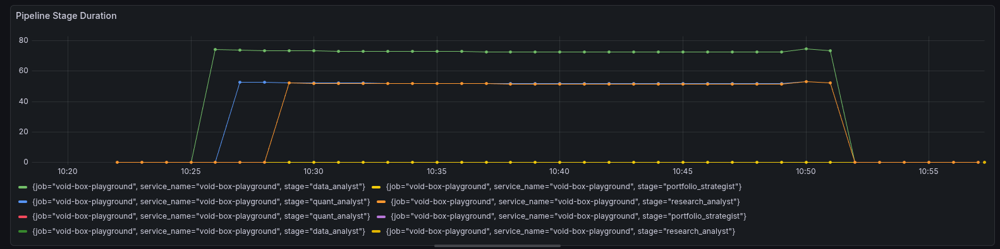

# Playground Stack

Run a 4-stage AI trading pipeline inside real KVM micro-VMs with full
observability (traces + metrics) via OpenTelemetry.

The pipeline stages — **research → analysis → strategy → risk** — each execute
in an isolated void-box VM. Every stage is traced end-to-end and exported via
OTLP to Grafana Tempo and Prometheus.

## Screenshots

**Trace waterfall (Grafana Tempo)**


**Pipeline stage metrics (Prometheus)**



## Prerequisites

- **KVM** — `/dev/kvm` must be accessible
- **Guest image** — build with `scripts/build_guest_image.sh`
- **Ollama** (optional) — install locally for the free provider path

## Start

```bash
playground/up.sh
```

This brings up the observability stack (Grafana, Tempo, Prometheus, OTel
Collector) and runs the trading pipeline.

### Provider options

By default the pipeline uses **Anthropic** (`ANTHROPIC_API_KEY` must be set).
To use a local Ollama model instead:

```bash
PROVIDER=ollama playground/up.sh
```

## Stop

```bash
playground/up.sh --down
```

## Services

- Grafana: `http://localhost:3000`
- OTLP gRPC ingest: `localhost:4317`
- OTLP HTTP ingest: `localhost:4318`

After a run, `playground/up.sh` prints direct Grafana links:
- Traces (Tempo Explore)
- Metrics (Prometheus Explore)

Logs are stored locally at `/tmp/void-box-playground-last.log` by default.
